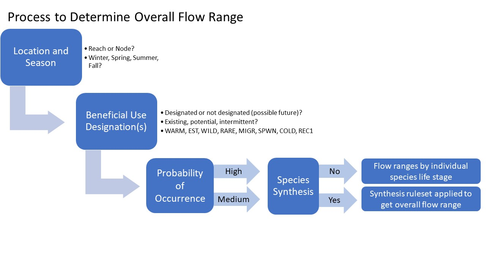
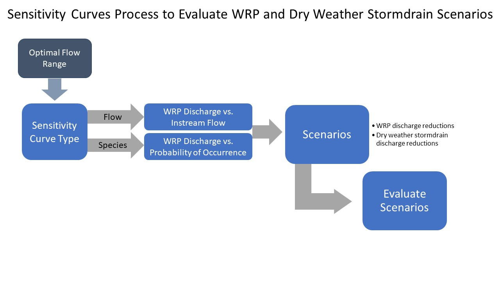

```{r setup, include=FALSE}
library(tidyverse)
library(ggthemes)
library(glue)
library(leaflet)
library(ggfittext)
library(rgdal)

knitr::opts_chunk$set(echo = FALSE,warning = FALSE,comment = NA,message = FALSE,
                      fig.path = "www")


sensitivity_dat <- read_csv("raw/SynthesisCurves_SpeciesProb.csv") %>% 
  filter(species.lifestage.hyd %in% c("Typha Adult Depth","Typha Adult Velocity",
                                      "Cladophora Adult Depth","Cladophora Adult Velocity",
                                      "Sas Adult Velocity","Sas Adult Depth",
                                      "Steelhead Prolonged Depth","Sas Juvenile Depth",
                                      "Steelhead Burst Depth","Steelhead Smolts Depth",
                                      "Steelhead Burst Velocity","Typha Seedling Depth")) %>% 
  rename(Node = ReportingNode,
         species_lifestage = species.lifestage,
         species_lifestage_hyd = species.lifestage.hyd)


dat <- read.csv("raw/FlowRanges_Species_RecUses_Allnodes_04132021.csv",
                encoding = "UTF-8",stringsAsFactors = FALSE) %>% 
  mutate(Species = factor(Species),
         Lower_Limit = as.double(Lower_Limit),
         Upper_Limit = as.double(Upper_Limit),
         Designation_Category = fct_recode(Designation_Category,"Existing"="E",
                                           "Potential"="P",
                                           "Intermittent"="I"),
         Species_Label = str_replace_all(Species_Label, " ", "\n") %>% 
           factor(., sort(unique(.), decreasing = T), ordered = T) %>% fct_relevel(., levels(.)[13], after = 4)
         ) %>%
  rename(Seasonal_Component= Seasonal.Component)


seasons = dat %>% select(Seasonal_Component) %>% unlist() %>% unique()
names(seasons)=NULL


dat_designated <- dat %>% filter(Designation_BU == "Designated")
dat_not_designated <- dat %>% filter(Designation_BU == "Not Designated")


hex <- tableau_color_pal("Tableau 20")(nlevels(dat$Species_Label))
hex[c(7:10)] <- rev(hex[c(7:10)])
species_colors <- setNames(hex, levels(dat$Species_Label))


WRP <- read.csv("data/iterations_labeled_seasonal.csv") 
FMM <- read.csv("data/FFM_percentiles_wetdrybaseflowmag_02172021_baselineWRP.csv")
FlowRanges <- read.csv("data/FlowRanges_Species_RecUses_Allnodes_03142021.csv")

river <- readOGR("data/LAR_reporting_reaches.shp")
river <- spTransform(river, CRS("+proj=longlat +datum=WGS84 +no_defs"))

```

#  {.tabset .tabset-pills}

## Overview {.tabset}

#### **Welcome to the Los Angeles (LA) River Environmental Flows Dashboard!**


This interactive web page will allow you to explore flow ranges associated with beneficial uses of the LA River (**Flow Range Determination**) and **Sensitivity Curves**, evaluate the relative effects of various WRP discharges on multiple locations of the river (**Flow Range Heat Map**), and visualize flow at multiple cross sections (**Flow Depth Visualizer**). Start by using the menu sections on the top.

------------------------------------------------------------------------

<font size="5">Project Background</font>

SCCWRP is working with the State Water Resources Control Board and the Los Angeles Regional Water Quality Control Board, in cooperation with local municipalities (including City of LA Bureau of Sanitation, City of LA Department of Water and Power, LA County Department of Public Works, and LA County Sanitation Districts), to conduct the Los Angeles River Environmental Flows Project (Project). The goals of the project are to develop a process for establishing flow criteria, to apply the process to provide recommendations for flow criteria in the LA River, and to produce tools and approaches to evaluate management scenarios necessary to achieve recommended flow criteria. The project also serves as an important pilot application of the California Environmental Flows Framework (CEFF) by demonstrating how CEFF can be applied in a highly urbanized watershed where flow alteration is primarily caused by wastewater and stormwater discharges. The outcomes of this project may also serve as a model for assessing similar situations in other river systems.

For more information about this project, go to <https://www.sccwrp.org/about/research-areas/ecohydrology/los-angeles-river-flows-project/>

------------------------------------------------------------------------

<font size="5"> Flow Range Determination </font>

Background on section and descriptions of use

User decision flow chart



------------------------------------------------------------------------

<font size="5">Sensitivity Curves</font>

Background on section and descriptions of use

Example sensitivity curve and description of plots [flow- and species-based]



------------------------------------------------------------------------

<font size="5">Flow Range Heat Maps</font>

Background on section and descriptions of use

------------------------------------------------------------------------

<font size="5">Flow Depth Visualizer</font>

Background on section and descriptions of use

## Flow Range Determination {.tabset}

```{r}
fluidPage(tags$h3("Location and Season"),
          fluidRow(column(4,
                          radioButtons("location", label = "Select Location:",
                                       choices = c("Node","Reporting Reach",
                                                   "LA River Reach-Master Plan"),
                                       selected="Node")),
                   renderUI({column(4,
                                    if(input$location == "Reporting Reach"){
                                      selectInput("Reach",label = "Specific Location:",
                                                  choices = location_choice() %>%
                                                    unique() %>% sort)
                                    }
                                    else if (input$location == "Node"){
                                      selectInput("Node",label = "Specific Location:",
                                                  choices = location_choice() %>%
                                                    unique)
                                    }
                                    else{
                                      selectInput("MasterLA",label = "Specific Location:",
                                                  choices = location_choice() %>% unique
                                                  %>% sort)
                                    }) }), 
                   column(4,
                          selectInput("season", label = "Select Season:",
                                      choices = c("All",seasons),
                                      selected= c("All",seasons) %>%  .[1]))
          ))

location_choice <- reactive({
  switch(input$location,
         "Reporting Reach" = dat$Reach,
         "Node"= dat$Node,
         "LA River Reach-Master Plan" = dat$waterbody)
})

```

------------------------------------------------------------------------

```{r}
BUnames <- reactive({
  
  if(input$designateBU == "Designated"){
    
    if(input$location=="Node"){
      validate(need(input$Node != ""," "))
      out <- c("All", dat_designated %>% filter(Node == input$Node) %>% pull(BU_names) %>%
                 str_extract_all('[A-Z]+') %>% unlist() %>% unique() %>% na.omit)
      return(out)    
    }
    else if(input$location == "Reporting Reach"){
      validate(need(input$Reach != ""," "))
      out <- c("All", dat_designated %>% filter(Reach == input$Reach) %>% pull(BU_names) %>%
                 str_extract_all('[A-Z]+') %>% unlist() %>% unique() %>% na.omit)
      return(out)      
    }
    else{
      validate(need(input$MasterLA != ""," "))
      out <- c("All", dat_designated %>% filter(waterbody == input$MasterLA) 
               %>% pull(BU_names) %>% str_extract_all('[A-Z]+') %>% unlist() 
               %>% unique() %>% na.omit)
      return(out)       
    }
  }
  else{
    if(input$location=="Node"){
      validate(need(input$Node != ""," "))
      out <- c("All", dat_not_designated %>% filter(Node == input$Node) %>% pull(BU_names) %>%
                 str_extract_all('[A-Z]+') %>% unlist() %>% unique() %>% na.omit)
      return(out)    
    }
    else if(input$location == "Reporting Reach"){
      validate(need(input$Reach != ""," "))
      out <- c("All", dat_not_designated %>% filter(Reach == input$Reach) %>% pull(BU_names) %>%
                 str_extract_all('[A-Z]+') %>% unlist() %>% unique() %>% na.omit)
      return(out)      
    }
    else{
      validate(need(input$MasterLA != ""," "))
      out <- c("All", dat_not_designated %>% filter(waterbody == input$MasterLA) 
               %>% pull(BU_names) %>% str_extract_all('[A-Z]+') %>% unlist() 
               %>% unique() %>% na.omit)
      return(out)       
    }  
  }
  
})

```

```{r,eval=TRUE}
# This is the old layout- works but doesnt account for designated/not designated
fluidPage(tags$h3("Beneficial Use Designation"),
          fluidRow(
            column(4,
                   radioButtons("designateBU", label = " Current Designation:",
                                choices = c("Designated","Not Designated"),
                                selected= "Designated")),
            renderUI({
              column(4,
                     selectInput("BU_names", label = "Beneficial Use Name(s):",
                                 choices = BUnames(),
                                 selected = "All")) }),
            renderUI({
              column(4,
                     if(input$designateBU == "Designated"){
                       selectInput("designations", label = "Designation Type:",
                                   choices = c("All","Existing",
                                               "Potential","Intermittent"),
                                   selected= "All")                      
                     }
              )
            }) ))
```

```{r, Beneficial Use Designation,eval=FALSE}
fluidPage(tags$h3("Beneficial Use Designation"),
                          radioButtons("designateBU", label = " Current Designation:",
                                       choices = c("Designated","Not Designated"),
                                       selected= "Designated"))
          


fluidPage(
  fluidRow(column(4, 
                  renderUI({
                    selectInput("BU_names", label = "Beneficial Use Name(s):",
                                choices = BUnames(),
                                selected = "All") })),
           renderUI({
             column(4,
                    if(input$designateBU == "Designated"){
                      selectInput("designations", label = "Designation Type:",
                                  choices = c("All","Existing",
                                              "Potential","Intermittent"),
                                  selected= "All")                      
                    })
           })
  ))
```

------------------------------------------------------------------------

```{r}
fluidPage(tags$h3("Species"),
          fluidRow(
            column(4,
                   selectInput("probthresh", label = "Probability of Occurrence:",
                               choices = c("Medium","High"),
                               selected= "Medium")),
            column(4,
                   radioButtons("synthesis",label="Species Synthesis:",
                                choices=c("Yes","No"),
                                selected="No")),
            renderUI({
              column(4,
                     if(input$synthesis == "Yes"){
                       radioButtons("synthesis_type",label="Type of Species Synthesis:",
                                    choices=c("Single","Multiple"),
                                    selected="Single")
                     }
              )
            })
          ))
```

If Species Synthesis is Yes - synthesis ruleset applied to get overall flow recommendations

Otherwise, flow recommendations by individual life stages

------------------------------------------------------------------------

```{r}
boxplot_dat <- reactive({
  validate(need(input$designations != ""," "))
  
  if(input$season != "All"){
    season = input$season
  }
  else{
    season = seasons
  }
  
  if(input$designations == "All"){
    designate_category = c("Existing","Intermittent", "Potential")
  }
  else{
    designate_category = input$designations
  }
  
  if(input$BU_names != "All"){
    beneficial_use_names = dat$BU_names[grep(input$BU_names,dat$BU_names)]
  }
  else{
    beneficial_use_names = unique(dat$BU_names)
  }
  
  if(input$location == "Node"){
    validate(need(input$Node != ""," "))
    out <- dat %>% filter(Node == input$Node,
                          Designation_BU == input$designateBU |is.na(Designation_BU),
                          Seasonal_Component %in% season,
                          Designation_Category %in% designate_category |
                            is.na(Designation_Category),
                          BU_names %in% beneficial_use_names|is.na(BU_names),
                          Probability_Threshold == input$probthresh|
                            is.na(Probability_Threshold),
                          metric %in% c("DS_Mag_50","Wet_BFL_Mag_10",
                                        "Peak_2 as lower, Peak_10 as upper")|
                            is.na(metric)) %>% 
      mutate(Species_Label = fct_drop(Species_Label))
  }
  else if(input$location == "Reporting Reach"){
    validate(need(input$Reach != ""," "))
    out <- dat %>% filter(Reach == input$Reach,
                          Designation_BU == input$designateBU |is.na(Designation_BU),
                          Seasonal_Component %in% season,
                          Designation_Category %in% designate_category |
                            is.na(Designation_Category),
                          BU_names %in% beneficial_use_names|is.na(BU_names),
                          Probability_Threshold == input$probthresh|
                            is.na(Probability_Threshold),
                          metric %in% c("DS_Mag_50","Wet_BFL_Mag_10",
                                        "Peak_2 as lower, Peak_10 as upper")| is.na(metric)) 
  }
  else{
    validate(need(input$MasterLA != ""," "))
    out <- dat %>% filter(waterbody == input$MasterLA,
                          Designation_BU == input$designateBU |is.na(Designation_BU),
                          Seasonal_Component %in% season,
                          Designation_Category %in% designate_category |
                            is.na(Designation_Category),
                          BU_names %in% beneficial_use_names|is.na(BU_names),
                          Probability_Threshold == input$probthresh|
                            is.na(Probability_Threshold),
                          metric %in% c("DS_Mag_50","Wet_BFL_Mag_10",
                                        "Peak_2 as lower, Peak_10 as upper")| is.na(metric))   
  }
  return(out)
})
```

```{r}
box_plot <- reactive({
  
  dat <- boxplot_dat()
  
  if(input$location=="Node"){
    dat <- dat %>% 
      filter(!is.na(Lower_Limit), !is.na(Upper_Limit)) %>% 
      mutate(flow_range = str_c(floor(Lower_Limit), ceiling(Upper_Limit), sep = '-'))
    
    g <- ggplot() + 
      geom_rect(aes(xmin = as.factor(as.numeric(Species_Label) - 0.4), 
                    xmax = as.factor(as.numeric(Species_Label) + 0.4),
                    ymin = Lower_Limit,
                    ymax = Upper_Limit, fill = Species_Label), color = 'black', data = dat) +
      geom_text(aes(x = as.factor(as.numeric(Species_Label)), y = Upper_Limit, 
                    label = flow_range, vjust = -0.5), data = dat, size = 4)
    
    ADDBOX <- FALSE
    if(input$synthesis == "Yes") {
      if(input$synthesis_type == "Single") {
        dat2 <- dat %>% 
          distinct(Seasonal_Component, species, Species_Label, Lower_Limit, Upper_Limit) %>%
          group_by(Seasonal_Component, species) %>%
          mutate(count = n(),
                 Lower_Limit = max(Lower_Limit, na.rm = T),
                 Upper_Limit = min(Upper_Limit, na.rm = T)) %>%
          mutate(species_type = ifelse(Species_Label == min(Species_Label), 'Min', 'Max')) %>% 
          ungroup() %>% filter(count > 1, !species %in% c("Rec.", "Current"),
                               Upper_Limit > Lower_Limit)
      } else { 
        # Multiple synthesis
        dat2 <- dat %>% 
          distinct(Seasonal_Component, species, Species_Label, Lower_Limit, Upper_Limit) %>% 
          filter(!species %in% c("Current", "Rec.")) %>% 
          group_by(Seasonal_Component) %>% 
          mutate(ll = max(Lower_Limit, na.rm = T),
             ul = min(Upper_Limit, na.rm = T)) %>%
      mutate(Upper_Limit = ifelse(ul < ll & Upper_Limit == ul, NA, Upper_Limit)) %>%
      na.omit() %>% 
      mutate(count = n()) %>% 
      mutate(Lower_Limit = max(Lower_Limit, na.rm = T),
             Upper_Limit = min(Upper_Limit, na.rm = T)) %>%
          mutate(species_type = ifelse(Species_Label == min(Species_Label), 'Min', 
                                       ifelse(Species_Label == max(Species_Label), 'Max', NA))) %>% 
          ungroup() %>% 
          filter(count > 1, !is.na(species_type), Upper_Limit > Lower_Limit)
      }
      if(nrow(dat2) > 0) {
        ADDBOX <- TRUE
        dat2 <- dat2 %>% rowwise() %>% 
          mutate(species = if_else(input$synthesis_type == "Multiple", "Multiple", species)) %>% 
          pivot_wider(id_cols = c(Seasonal_Component, Lower_Limit, Upper_Limit, species), names_from = species_type, values_from = Species_Label) %>% 
          mutate(label_range = glue::glue("{species}:\n{range} cfs", species = species, range = str_c(Lower_Limit, Upper_Limit, sep = '-')),
                 yloc = (Lower_Limit + Upper_Limit)/2,
                 xloc = (as.numeric(Min) + as.numeric(Max))/2)
      }
    }
    
    g + {if(ADDBOX) list(geom_rect(aes(xmin = as.factor(as.numeric(Min) - 0.4), 
                                xmax = as.factor(as.numeric(Max) + 0.4), 
                                ymin = Lower_Limit, ymax = Upper_Limit),
                            data = dat2, fill = 'black', alpha = 0.4, color = 'black', size = 1),
          ggfittext::geom_fit_text(aes(xmin = as.factor(as.numeric(Min) - 0.4),
                                       xmax = as.factor(as.numeric(Max) + 0.4),
                                       ymin = Lower_Limit,
                                       ymax = Upper_Limit, label = label_range, fontface = 'bold'),
                                   data = dat2, contrast = T, reflow = T,
                                   na.rm = T, size = 12))} +
      scale_x_discrete(breaks = 1:nlevels(dat$Species_Label), labels = levels(dat$Species_Label)) +
      facet_wrap(~ Seasonal_Component, scales="free", drop = F) +
      theme(strip.text = element_text(face = "bold", size = 12),
            strip.background = element_rect(fill = "white", 
                                            colour = "black",size = 1)) +
      scale_fill_manual(name = "Species", values = species_colors) +
      theme(legend.position = "bottom",
            panel.grid.minor.y = element_blank()) +
      labs(title="Flow Ranges", x = "", y = "Flow (cfs)") +
      scale_y_log10()
  }
  else{
    ggplot(dat,aes(x=Species_Label, ymin = Lower_Limit,
                   lower = Lower_Limit,middle=(Lower_Limit+Upper_Limit)/2,
                   upper = Upper_Limit, ymax = Upper_Limit,
                   fill= Species_Label)) +
      geom_boxplot(stat = "identity",fatten=NULL) +
      facet_grid(Node~ Seasonal_Component, scales="free") +
      theme(strip.text = element_text(face="bold", size=12),
            strip.background = element_rect(fill="white", 
                                            colour="black",size=1)) +
      scale_fill_manual(values = species_colors) +
      theme(legend.position="bottom",
            panel.grid.minor.y = element_blank(),
      ) +
      labs(title="Flow Ranges",x ="", y = "Flow (cfs)",
           fill="Species - Lifestage")+
      scale_y_log10()   
  }
})


```

```{r}
output$boxfig <- downloadHandler(
  filename = function() {
    if(input$location=="Node"){
      paste(input$Node, '.png', sep='') 
    }
    else if(input$location == "Reach"){
      paste(input$Reach, '.png', sep='') 
    }
    else{
      paste(input$MasterLA, '.png', sep='') 
    }},
  content = function(file) {
    ggsave(file, plot = box_plot(), device = "png",
           width = 30, height = 20, units = "cm")
  }
)

output$boxdat <- downloadHandler(
  filename = function() {
    if(input$location=="Node"){
      paste(input$Node, '.csv', sep='') 
    }
    else if (input$location == "Reach"){
      paste(input$Reach, '.csv', sep='') 
    }
    else{
      paste(input$MasterLA, '.csv', sep='')         
    }},
  content = function(file) {
    write.csv(boxplot_dat(), file, quote = T, row.names = F)
  }
)

```

```{r}
fluidPage(
downloadButton('boxdat', 'Download Data'),
downloadButton('boxfig', 'Download Boxplot')
)
renderPlot({box_plot()},height=600,width=1100)
```

```{r}
ranges_print <- function(x)
{
  ranges = round(range(x),2)
  paste(ranges[1],"-",ranges[2])
}


is_integer0 <- function(x)
{
  is.integer(x) && length(x) == 0L
}
```

```{r}
synthesis <- reactive({
  
  filter_check <- boxplot_dat() %>% filter(!Species %in% c("Rec. Use - Kayak",
                                                           "Rec. Use - Fishing",
                                                           "Current Flow"))
  if(input$season != "All"){
    
    if(nrow(filter_check)==0){
      dat <-  boxplot_dat() %>% filter(Species %in% c("Rec. Use - Kayak",
                                                      "Rec. Use - Fishing",
                                                      "Current Flow")) %>%
        group_by(Seasonal_Component,Species) %>%
        select(Species,Lower_Limit,Upper_Limit)  %>%
        summarise(ranges = list(seq(from = Lower_Limit,to = Upper_Limit))) %>% 
        group_split()
    }
    else{
      dat <-  boxplot_dat() %>% filter(!Species %in% c("Rec. Use - Kayak",
                                                       "Rec. Use - Fishing",
                                                       "Current Flow")) %>%
        group_by(Seasonal_Component,Species) %>%
        select(Species,Lower_Limit,Upper_Limit)  %>%
        summarise(ranges = list(seq(from = Lower_Limit,to = Upper_Limit))) %>% 
        group_split()
    }
    season = input$season
    names(dat) = season
    
    seasonal_ranges = list()
    seasonal_species = list()
    
    for(i in 1:length(dat)){
      seasonal_ranges[[i]] = dat %>%
        pluck(i) %>%
        group_by(Species) %>%
        pluck("ranges")
    }
    for(i in 1:length(dat)){
      seasonal_species[[i]] = dat %>%
        pluck(i,"Species")
    }
    
    names(seasonal_ranges) = season
    names(seasonal_species) = NULL
    
    names(seasonal_ranges[[season]]) =unlist(seasonal_species) %>% as.character() 
    ranges = lapply(seasonal_ranges[[season]],ranges_print)
    
    out <- tibble("Season" = season,
                  "Species" = unlist(seasonal_species) %>% as.character(),
                  "Ranges (cfs)" = unlist(ranges))
    return(list("Table"=out,seasonal_ranges))
  }
  else{
    out <- boxplot_dat() %>% select(Seasonal_Component,Species,
                                    Lower_Limit,Upper_Limit) %>%
      rename(Season = Seasonal_Component) %>%
      group_by(Season,Species) %>%
      summarise(Ranges = list(seq(from = Lower_Limit,to = Upper_Limit) %>%
                                ranges_print))
    return(out)
  }
})


synthesis_current_flows <- reactive({
  
  flows <- boxplot_dat() %>% filter(Species=="Current Flow") %>%
    group_by(Seasonal_Component) %>%
    select(Species,Lower_Limit,Upper_Limit) %>%
    summarise(ranges = list(seq(from = Lower_Limit,to = Upper_Limit))) %>%
    pull(ranges)  
  
  if(input$season != "All"){
    
    season = input$season
    names(flows) = season
    
    out <- flows %>% pluck(season) %>% ranges_print
    
    return(out)
  }
  else{
    return(NULL)
  }
})


```

```{r}
DT::renderDataTable({
  if(input$synthesis == "Yes" & input$location == "Node" & input$season != "All"){
    if(input$synthesis_type == "Single"){
      if(input$season != "All"){
        
        choices <- synthesis()[["Table"]] %>% pull(Species) %>%
          strsplit(" - ") %>%
          unlist() %>%
          unique() %>%
          str_trim() %>% .[.!="Adult"] %>%  .[.!="Growth"]
        
        choices_ranges = c()
        
        for(i in 1:length(choices)){
          choices_ranges[i] = Reduce(intersect,
                                     synthesis()[[2]][[input$season]][grep(choices[i],
                                                                           synthesis()[[1]] %>%
                                                                             pull(Species))]) %>%
            ranges_print()
        }
        out <- tibble(Season = input$season,
                      Species = choices,
                      Ranges = choices_ranges ,
                      "Current Flow (cfs)" = synthesis_current_flows())
        return(out)
      }
      else{
        synthesis()
      }}
    else{
      if(input$season != "All"){
        species_season <- synthesis()[["Table"]] %>% pull(Species) %>%
          unlist() %>%
          unique()
        
        species_list = list()
        for(i in 1:length(species_season)){
          
          species_list[[i]] = suppressWarnings(
            as_tibble(species_season %>% combn(i) %>% t()) %>%
              rowwise() %>%
              mutate(Ranges = Reduce(intersect,
                                     synthesis()[[2]][[input$season]][
                                       grep(str_c(c_across(),collapse = "|"),
                                            species_season)]) %>% 
                       range() %>% ranges_print()) %>% 
              mutate(Range_Diff = Reduce(intersect,
                                         synthesis()[[2]][[input$season]][
                                           grep(str_c(c_across(),
                                                      collapse = "|"),
                                                species_season)])
                     %>% range() %>% diff()) %>%
              filter(Range_Diff != "-Inf") %>%
              ungroup() %>%
              top_n(Range_Diff,n=1))
        }
        
        
        multiple_synthesis <- discard(species_list, function(x) nrow(x) == 0) %>%
          last() %>% select(-c("Range_Diff"))
        
        names(multiple_synthesis)[-length(multiple_synthesis)] <- paste0("Species ",
                                                                         seq_along(multiple_synthesis[-length(multiple_synthesis)]))
        return(multiple_synthesis)
      }
      else{
        synthesis()
      }
    }}
},options = list(dom = 't'))
```

## Sensitivity Curves {.tabset .tabset-pills}

```{r}
flowranges <- read_csv("raw/Willow_Typha_Med_High_FishingKayaking_Flowranges.csv") %>% mutate(season = case_when(Seasonal.Component == "Dry Season Baseflow" ~ "dry",
                                                                                                                 Seasonal.Component == "Wet Season Baseflow" ~ "wet"))


SpeciesProb <- read_csv("raw/SpeciesProb_dat.csv") %>%
  mutate(season = case_when(season == "Dry" ~ "dry",
                            season == "Wet" ~ "wet"))

```

```{r}
fluidPage(tags$h3("Location and Season"),
          fluidRow(column(3,
                          selectInput("node", "Specific Location:",
                                      c("LA11", "F34D", "F57C","GLEN",
                                        "LA3","LA8","LA13","LA14",
                                        "F319","F300"))), 
                   column(3,
                          selectInput("sens_season", label = "Select Season:",
                                      choices = c("Dry"="dry","Wet"="wet")))))
```

------------------------------------------------------------------------

### Flow-Based Curve

```{r}
fluidPage(tags$h3("Species"),
          fluidRow(column(3,selectInput("sens_species",label="Select Species:",
                                        choices = c("Fishing","Kayak","Typha",
                                                    "Willow") )),
                   column(3,selectInput("sens_prob",label="Select Probability Threshold",choices = c("Medium","High"))),
                   column(3,
                          selectInput("sens_UBF", label = "Select Additional UBF:",
                                      choices = c("None","UBF0","UBF50",
                                                  "UBF0 and UBF50"),
                                      selected="None")),
                   column(3,tags$h3(""),
                          downloadButton('sensitivity_curve', 'Download Sensitivity Curve'))))
```

```{r}
#Did they fall in the range? 
fmDry <- FMM[!grepl("Wet", FMM$Season),] #dry only
fmWet <- FMM[!grepl("Dry", FMM$Season),] #wet only


flowRDry0 <- FlowRanges[!grepl("Wet_BFL_Mag_50", FlowRanges$metric),] #dry 
flowRDry1 <- flowRDry0[!grepl("Wet_BFL_Mag_10", flowRDry0$metric),] #dry 

flowRWet0 <- FlowRanges[!grepl("DS_Mag_50", FlowRanges$metric),] #wet 
flowRWet1 <- flowRWet0[!grepl("DS_Mag_10", flowRWet0$metric),] #wet
```

```{r}
filtered_flowranges <- reactive({
  validate(need(input$node != ""," "))
  validate(need(input$sens_prob != ""," "))
  validate(need(input$sens_species != ""," "))
  validate(need(input$sens_season != ""," "))
  
  out <- flowranges %>% 
    filter(season == input$sens_season) %>% 
    filter(Node == input$node) %>% 
    filter(Species == input$sens_species) %>% 
    filter(Probability_Threshold == input$sens_prob) %>% 
    select(Lower_Limit,Upper_Limit)
  
  return(out)
  
})
```

```{r}
sens_curve <- reactive({
  
  
  validate(need(input$sens_season != ""," "))
  validate(need(input$node != ""," "))
  
  x = 0:100
  source('R/sensitivity_curves_UBF0.R')
  source('R/sensitivity_curves_UBF50.R')
  source('R/sensitivity_curves_UBF100.R')
  
  if(input$sens_season == "wet"){
    fm <- fmWet
    flow <- flowRWet1
    F300p10 <- F300p10Wet
    F319p10 <- F319p10Wet
    F57Cp10 <-F57Cp10Wet
    LA13p10 <- LA13p10Wet
    LA11p10 <- LA11p10Wet
    F34Dp10 <- F34Dp10Wet
    LA14p10 <- LA14p10Wet
    GLENp10 <- GLENp10Wet
    LA8p10 <- LA8p10Wet
    LA3p10 <- LA3p10Wet
    F300p50 <- F300p50Wet
    F319p50 <- F319p50Wet
    F57Cp50 <-F57Cp50Wet
    LA13p50 <- LA13p50Wet
    LA11p50 <- LA11p50Wet
    F34Dp50 <- F34Dp50Wet
    LA14p50 <- LA14p50Wet
    GLENp50 <- GLENp50Wet
    LA8p50 <- LA8p50Wet
    LA3p50 <- LA3p50Wet
    F300p90 <- F300p90Wet
    
    F319p90 <- F319p90Wet
    
    F57Cp90 <- F57Cp90Wet
    
    
    LA13p90 <- LA13p90Wet
    
    
    LA11p90 <- LA11p90Wet
    
    
    F34Dp90 <- F34Dp90Wet
    
    
    LA14p90 <- LA14p90Wet
    
    GLENp90 <- GLENp90Wet
    
    
    LA8p90 <- LA8p90Wet
    
    
    LA3p90 <- LA3p90Wet
    #UBF50
    F300p10_UBF50 <- F300p10Wet_UBF50
    F319p10_UBF50 <- F319p10Wet_UBF50
    F57Cp10_UBF50 <-F57Cp10Wet_UBF50
    LA13p10_UBF50 <- LA13p10Wet_UBF50
    LA11p10_UBF50 <- LA11p10Wet_UBF50
    F34Dp10_UBF50 <- F34Dp10Wet_UBF50
    LA14p10_UBF50 <- LA14p10Wet_UBF50
    GLENp10_UBF50 <- GLENp10Wet_UBF50
    LA8p10_UBF50 <- LA8p10Wet_UBF50
    LA3p10_UBF50 <- LA3p10Wet_UBF50
    F300p50_UBF50 <- F300p50Wet_UBF50
    F319p50_UBF50 <- F319p50Wet_UBF50
    F57Cp50_UBF50 <-F57Cp50Wet_UBF50
    LA13p50_UBF50 <- LA13p50Wet_UBF50
    LA11p50_UBF50 <- LA11p50Wet_UBF50
    F34Dp50_UBF50 <- F34Dp50Wet_UBF50
    LA14p50_UBF50 <- LA14p50Wet_UBF50
    GLENp50_UBF50 <- GLENp50Wet_UBF50
    LA8p50_UBF50 <- LA8p50Wet_UBF50
    LA3p50_UBF50 <- LA3p50Wet_UBF50
    F300p90_UBF50 <- F300p90Wet_UBF50
    
    F319p90_UBF50 <- F319p90Wet_UBF50
    
    F57Cp90_UBF50 <- F57Cp90Wet_UBF50
    
    
    LA13p90_UBF50 <- LA13p90Wet_UBF50
    
    
    LA11p90_UBF50 <- LA11p90Wet_UBF50
    
    
    F34Dp90_UBF50 <- F34Dp90Wet_UBF50
    
    
    LA14p90_UBF50 <- LA14p90Wet_UBF50
    
    GLENp90_UBF50 <- GLENp90Wet_UBF50
    
    
    LA8p90_UBF50 <- LA8p90Wet_UBF50
    
    
    LA3p90_UBF50 <- LA3p90Wet_UBF50
    #UB100
    F300p10_UBF100 <- F300p10Wet_UBF100
    F319p10_UBF100 <- F319p10Wet_UBF100
    F57Cp10_UBF100 <-F57Cp10Wet_UBF100
    LA13p10_UBF100 <- LA13p10Wet_UBF100
    LA11p10_UBF100 <- LA11p10Wet_UBF100
    F34Dp10_UBF100 <- F34Dp10Wet_UBF100
    LA14p10_UBF100 <- LA14p10Wet_UBF100
    GLENp10_UBF100 <- GLENp10Wet_UBF100
    LA8p10_UBF100 <- LA8p10Wet_UBF100
    LA3p10_UBF100 <- LA3p10Wet_UBF100
    F300p50_UBF100 <- F300p50Wet_UBF100
    F319p50_UBF100 <- F319p50Wet_UBF100
    F57Cp50_UBF100 <-F57Cp50Wet_UBF100
    LA13p50_UBF100 <- LA13p50Wet_UBF100
    LA11p50_UBF100 <- LA11p50Wet_UBF100
    F34Dp50_UBF100 <- F34Dp50Wet_UBF100
    LA14p50_UBF100 <- LA14p50Wet_UBF100
    GLENp50_UBF100 <- GLENp50Wet_UBF100
    LA8p50_UBF100 <- LA8p50Wet_UBF100
    LA3p50_UBF100 <- LA3p50Wet_UBF100
    F300p90_UBF100 <- F300p90Wet_UBF100
    
    F319p90_UBF100 <- F319p90Wet_UBF100
    
    F57Cp90_UBF100 <- F57Cp90Wet_UBF100
    
    
    LA13p90_UBF100 <- LA13p90Wet_UBF100
    
    
    LA11p90_UBF100 <- LA11p90Wet_UBF100
    
    
    F34Dp90_UBF100 <- F34Dp90Wet_UBF100
    
    
    LA14p90_UBF100 <- LA14p90Wet_UBF100
    
    GLENp90_UBF100 <- GLENp90Wet_UBF100
    
    
    LA8p90_UBF100 <- LA8p90Wet_UBF100
    
    
    LA3p90_UBF100 <- LA3p90Wet_UBF100
  }
  else{
    fm <- fmDry
    flow <-flowRDry1
    F300p10 <- F300p10Dry
    F319p10 <- F319p10Dry
    F57Cp10 <-F57Cp10Dry
    LA13p10 <- LA13p10Dry
    LA11p10 <- LA11p10Dry
    F34Dp10 <- F34Dp10Dry
    LA14p10 <- LA14p10Dry
    GLENp10 <- GLENp10Dry
    LA8p10 <- LA8p10Dry
    LA3p10 <- LA3p10Dry
    F300p50 <- F300p50Dry
    F319p50 <- F319p50Dry
    F57Cp50 <-F57Cp50Dry
    LA13p50 <- LA13p50Dry
    LA11p50 <- LA11p50Dry
    F34Dp50 <- F34Dp50Dry
    LA14p50 <- LA14p50Dry
    GLENp50 <- GLENp50Dry
    LA8p50 <- LA8p50Dry
    LA3p50 <- LA3p50Dry
    F300p90 <- F300p90Dry
    
    F319p90 <- F319p90Dry
    
    F57Cp90 <- F57Cp90Dry
    
    LA13p90 <- LA13p90Dry
    
    LA11p90 <- LA11p90Dry
    
    F34Dp90 <- F34Dp90Dry
    
    LA14p90 <- LA14p90Dry
    
    GLENp90 <- GLENp90Dry
    
    LA8p90 <- LA8p90Dry
    
    LA3p90 <- LA3p90Dry
    #UBF50
    F300p10_UBF50 <- F300p10Dry_UBF50
    F319p10_UBF50 <- F319p10Dry_UBF50
    F57Cp10_UBF50 <-F57Cp10Dry_UBF50
    LA13p10_UBF50 <- LA13p10Dry_UBF50
    LA11p10_UBF50 <- LA11p10Dry_UBF50
    F34Dp10_UBF50 <- F34Dp10Dry_UBF50
    LA14p10_UBF50 <- LA14p10Dry_UBF50
    GLENp10_UBF50 <- GLENp10Dry_UBF50
    LA8p10_UBF50 <- LA8p10Dry_UBF50
    LA3p10_UBF50 <- LA3p10Dry_UBF50
    F300p50_UBF50 <- F300p50Dry_UBF50
    F319p50_UBF50 <- F319p50Dry_UBF50
    F57Cp50_UBF50 <-F57Cp50Dry_UBF50
    LA13p50_UBF50 <- LA13p50Dry_UBF50
    LA11p50_UBF50 <- LA11p50Dry_UBF50
    F34Dp50_UBF50 <- F34Dp50Dry_UBF50
    LA14p50_UBF50 <- LA14p50Dry_UBF50
    GLENp50_UBF50 <- GLENp50Dry_UBF50
    LA8p50_UBF50 <- LA8p50Dry_UBF50
    LA3p50_UBF50 <- LA3p50Dry_UBF50
    F300p90_UBF50 <- F300p90Dry_UBF50
    
    F319p90_UBF50 <- F319p90Dry_UBF50
    
    F57Cp90_UBF50 <- F57Cp90Dry_UBF50
    
    LA13p90_UBF50 <- LA13p90Dry_UBF50
    
    LA11p90_UBF50 <- LA11p90Dry_UBF50
    
    F34Dp90_UBF50 <- F34Dp90Dry_UBF50
    
    LA14p90_UBF50 <- LA14p90Dry_UBF50
    
    GLENp90_UBF50 <- GLENp90Dry_UBF50
    
    LA8p90_UBF50 <- LA8p90Dry_UBF50
    
    LA3p90_UBF50 <- LA3p90Dry_UBF50 
    #UBF100
    F300p10_UBF100 <- F300p10Dry_UBF100
    F319p10_UBF100 <- F319p10Dry_UBF100
    F57Cp10_UBF100 <-F57Cp10Dry_UBF100
    LA13p10_UBF100 <- LA13p10Dry_UBF100
    LA11p10_UBF100 <- LA11p10Dry_UBF100
    F34Dp10_UBF100 <- F34Dp10Dry_UBF100
    LA14p10_UBF100 <- LA14p10Dry_UBF100
    GLENp10_UBF100 <- GLENp10Dry_UBF100
    LA8p10_UBF100 <- LA8p10Dry_UBF100
    LA3p10_UBF100 <- LA3p10Dry_UBF100
    F300p50_UBF100 <- F300p50Dry_UBF100
    F319p50_UBF100 <- F319p50Dry_UBF100
    F57Cp50_UBF100 <-F57Cp50Dry_UBF100
    LA13p50_UBF100 <- LA13p50Dry_UBF100
    LA11p50_UBF100 <- LA11p50Dry_UBF100
    F34Dp50_UBF100 <- F34Dp50Dry_UBF100
    LA14p50_UBF100 <- LA14p50Dry_UBF100
    GLENp50_UBF100 <- GLENp50Dry_UBF100
    LA8p50_UBF100 <- LA8p50Dry_UBF100
    LA3p50_UBF100 <- LA3p50Dry_UBF100
    F300p90_UBF100 <- F300p90Dry_UBF100
    
    F319p90_UBF100 <- F319p90Dry_UBF100
    
    F57Cp90_UBF100 <- F57Cp90Dry_UBF100
    
    LA13p90_UBF100 <- LA13p90Dry_UBF100
    
    LA11p90_UBF100 <- LA11p90Dry_UBF100
    
    F34Dp90_UBF100 <- F34Dp90Dry_UBF100
    
    LA14p90_UBF100 <- LA14p90Dry_UBF100
    
    GLENp90_UBF100 <- GLENp90Dry_UBF100
    
    LA8p90_UBF100 <- LA8p90Dry_UBF100
    
    LA3p90_UBF100 <- LA3p90Dry_UBF100
  }
  fun.1 <- function(x) x^2 + x
  fun.1_UBF50 <- function(x) x^2 + x
  fun.1_UBF100 <- function(x) x^2 + x
  if(input$node == "LA11"){
    fun.1 <- LA11p10
    fun.1_UBF50 <- LA11p10_UBF50
    fun.1_UBF100 <- LA11p10_UBF100
    name = "LA11"
  }
  if(input$node == "F300"){
    fun.1 <- F300p10
    fun.1_UBF50 <- F300p10_UBF50
    fun.1_UBF100 <- F300p10_UBF100
    name = "F300"
  }
  if(input$node == "F319"){
    fun.1 <- F319p10
    fun.1_UBF50 <- F319p10_UBF50
    fun.1_UBF100 <- F319p10_UBF100
    name = "F319"
  }
  if(input$node == "LA13"){
    fun.1 <- LA13p10
    fun.1_UBF50 <- LA13p10_UBF50
    fun.1_UBF100 <- LA13p10_UBF100
    name = "LA13"
  }
  if(input$node == "F34D"){
    fun.1 <- F34Dp10
    fun.1_UBF50 <- F34Dp10_UBF50
    fun.1_UBF100 <- F34Dp10_UBF100
    name = "F34D"
  }
  if(input$node == "LA14"){
    fun.1 <- LA14p10
    fun.1_UBF50 <- LA14p10_UBF50
    fun.1_UBF100 <- LA14p10_UBF100
    name = "LA14"
  }
  if(input$node == "GLEN"){
    fun.1 <- GLENp10
    fun.1_UBF50 <- GLENp10_UBF50
    fun.1_UBF100 <- GLENp10_UBF100
    name = "GLEN"
  }
  if(input$node == "LA8"){
    fun.1 <- LA8p10
    fun.1_UBF50 <- LA8p10_UBF50
    fun.1_UBF100 <- LA8p10_UBF100
    name = "LA8"
  }
  if(input$node == "LA3"){
    fun.1 <- LA3p10
    fun.1_UBF50 <- LA3p10_UBF50
    fun.1_UBF100 <- LA3p10_UBF100
    name = "LA3"
  }
  if(input$node == "F57C"){
    fun.1 <- F57Cp10
    fun.1_UBF50 <- F57Cp10_UBF50
    fun.1_UBF100 <- F57Cp10_UBF100
    name = "F57C"
  }
  if(input$node == "LA20"){
    fun.1 <- F57Cp10
    fun.1_UBF50 <- F57Cp10_UBF50
    fun.1_UBF100 <- F57Cp10_UBF100
    name = "F57C"
  }
  if(input$node == "LA20_2"){
    fun.1 <- F57Cp10
    fun.1_UBF50 <- F57Cp10_UBF50
    fun.1_UBF100 <- F57Cp10_UBF100
    name = "F57C"
  }
  fun.2 <- function(x) x^2 + x
  fun.2_UBF50 <- function(x) x^2 + x
  fun.2_UBF100 <- function(x) x^2 + x
  if(input$node == "LA11"){
    fun.2 <- LA11p50
    fun.2_UBF50 <- LA11p50_UBF50
    fun.2_UBF100 <- LA11p50_UBF100
    name = "LA11"
  }
  if(input$node == "F300"){
    fun.2 <- F300p50
    fun.2_UBF50 <- F300p50_UBF50
    fun.2_UBF100 <- F300p50_UBF100
    name = "F300"
  }
  if(input$node == "F319"){
    fun.2 <- F319p50
    fun.2_UBF50 <- F319p50_UBF50
    fun.2_UBF100 <- F319p50_UBF100
    name = "F319"
  }
  if(input$node == "LA13"){
    fun.2 <- LA13p50
    fun.2_UBF50 <- LA13p50_UBF50
    fun.2_UBF100 <- LA13p50_UBF100
    name = "LA13"
  }
  if(input$node == "F34D"){
    fun.2 <- F34Dp50
    fun.2_UBF50 <- F34Dp50_UBF50
    fun.2_UBF100 <- F34Dp50_UBF100
    name = "F34D"
  }
  if(input$node == "LA14"){
    fun.2 <- LA14p50
    fun.2_UBF50 <- LA14p50_UBF50
    fun.2_UBF100 <- LA14p50_UBF100
    name = "LA14"
  }
  if(input$node == "GLEN"){
    fun.2 <- GLENp50
    fun.2_UBF50 <- GLENp50_UBF50
    fun.2_UBF100 <- GLENp50_UBF100
    name = "GLEN"
  }
  if(input$node == "LA8"){
    fun.2 <- LA8p50
    fun.2_UBF50 <- LA8p50_UBF50
    fun.2_UBF100 <- LA8p50_UBF100
    name = "LA8"
  }
  if(input$node == "LA3"){
    fun.2 <- LA3p50
    fun.2_UBF50 <- LA3p50_UBF50
    fun.2_UBF100 <- LA3p50_UBF100
    name = "LA3"
  }
  if(input$node == "F57C"){
    fun.2 <- F57Cp50
    fun.2_UBF50 <- F57Cp50_UBF50
    fun.2_UBF100 <- F57Cp50_UBF100
    name = "F57C"
  }
  fun.3 <- function(x) x^2 + x
  fun.3_UBF50 <- function(x) x^2 + x
  fun.3_UBF100 <- function(x) x^2 + x
  if(input$node == "LA11"){
    fun.3 <- LA11p90
    fun.3_UBF50 <- LA11p90_UBF50
    fun.3_UBF100 <- LA11p90_UBF100
    name = "LA11"
  }
  if(input$node == "F300"){
    fun.3 <- F300p90
    fun.3_UBF50 <- F300p90_UBF50
    fun.3_UBF100 <- F300p90_UBF100
    name = "F300"
  }
  if(input$node == "F319"){
    fun.3 <- F319p90
    fun.3_UBF50 <- F319p90_UBF50
    fun.3_UBF100 <- F319p90_UBF100
    name = "F319"
  }
  if(input$node == "LA13"){
    fun.3 <- LA13p90
    fun.3_UBF50 <- LA13p90_UBF50
    fun.3_UBF100 <- LA13p90_UBF100
    name = "LA13"
  }
  if(input$node == "F34D"){
    fun.3 <- F34Dp90
    fun.3_UBF50 <- F34Dp90_UBF50
    fun.3_UBF100 <- F34Dp90_UBF100
    name = "F34D"
  }
  if(input$node == "LA14"){
    fun.3 <- LA14p90
    fun.3_UBF50 <- LA14p90_UBF50
    fun.3_UBF100 <- LA14p90_UBF100
    name = "LA14"
  }
  if(input$node == "GLEN"){
    fun.3 <- GLENp90
    fun.3_UBF50 <- GLENp90_UBF50
    fun.3_UBF100 <- GLENp90_UBF100
    name = "GLEN"
  }
  if(input$node == "LA8"){
    fun.3 <- LA8p90
    fun.3_UBF50 <- LA8p90_UBF50
    fun.3_UBF100 <- LA8p90_UBF100
    name = "LA8"
  }
  if(input$node == "LA3"){
    fun.3 <- LA3p90
    fun.3_UBF50 <- LA3p90_UBF50
    fun.3_UBF100 <- LA3p90_UBF100
    name = "LA3"
  }
  if(input$node == "F57C"){
    fun.3 <- F57Cp90
    fun.3_UBF50 <- F57Cp90_UBF50
    fun.3_UBF100 <- F57Cp90_UBF100
    name = "F57C"
  }
  plotter<- data.frame(
    x=0:100,
    p10_UBF0 = fun.1,
    p50_UBF0 = fun.2,
    p90_UBF0 = fun.3,
    p10_UBF50 = fun.1_UBF50,
    p50_UBF50 = fun.2_UBF50,
    p90_UBF50 = fun.3_UBF50,
    p10_UBF100 = fun.1_UBF100,
    p50_UBF100 = fun.2_UBF100,
    p90_UBF100 = fun.3_UBF100
  )
  
  
  plotter_UBF0 <- plotter %>% select(x,p10_UBF0,p50_UBF0,p90_UBF0)
  plotter_UBF50 <- plotter %>% select(x,p10_UBF50,p50_UBF50,p90_UBF50)
  plotter_UBF100 <- plotter %>% select(x,p10_UBF100,p50_UBF100,p90_UBF100)
  
  
  base_plot <- ggplot()+
    geom_line(data=plotter_UBF100,aes(x=x,y = p50_UBF100, 
                                      colour="50th Percentile"),size = 1, 
              linetype = 1, color = "blue") +
    geom_ribbon(data =plotter_UBF100,
                aes(x=x,xmin=0,xmax=100,ymin=p10_UBF100,ymax=p90_UBF100), 
                fill = '#c3d0e6', alpha = .5)+
    labs(x = "Average Annual Season WRP Discharge (cfs)", 
         y = "Season Baseflow Magnitude (cfs)",title="10th - 90th Percentile")+
    theme_bw()+
    theme(axis.text = element_text(size = 12),
          axis.title=element_text(size=14,face="bold"),
          legend.text = element_text(size = 15))
  
  
  if(input$sens_UBF != "None"){
    
    if(input$sens_UBF =="UBF50"){
      g <- base_plot +
        geom_line(data=plotter_UBF50,aes(x=x,y = p50_UBF50),
                  size = 1, linetype = 2, color = "orange")+
        geom_ribbon(data =plotter_UBF50,
                    aes(x=x,xmin=0,xmax=100,ymin=p10_UBF50,ymax=p90_UBF50), 
                    fill = '#f0c67d', alpha = .5)
    }
    else if(input$sens_UBF == "UBF0"){
      g <- base_plot+ geom_line(data=plotter_UBF0,aes(x=x,y = p50_UBF0),
                                size = 1, linetype = 3, color = "red")+
        geom_ribbon(data =plotter_UBF0,
                    aes(x=x,xmin=0,xmax=100,ymin=p10_UBF0,ymax=p90_UBF0), 
                    fill = '#f0857d', alpha = .5)
    }
    else{
      g <- base_plot +
        geom_line(data=plotter_UBF0,aes(x=x,y = p50_UBF0),
                  size = 1, linetype = 3, color = "red")+
        geom_ribbon(data =plotter_UBF0,
                    aes(x=x,xmin=0,xmax=100,ymin=p10_UBF0,ymax=p90_UBF0),
                    fill = '#f0857d', alpha = .5)+
        geom_line(data=plotter_UBF50,aes(x=x,y = p50_UBF50),
                  size = 1, linetype = 2, color = "orange")+
        geom_ribbon(data =plotter_UBF50,
                    aes(x=x,xmin=0,xmax=100,ymin=p10_UBF50,ymax=p90_UBF50),
                    fill = '#f0c67d', alpha = .5)
    }
    if(nrow(filtered_flowranges()) >0){
      ymin = filtered_flowranges() %>% pull(Lower_Limit)
      ymax = filtered_flowranges() %>% pull(Upper_Limit)
      
      if(ymax > 180){
        ymax_limit = 180
      }
      else{
        ymax_limit = ymax
      }
      
      g +geom_ribbon(aes(x=x,xmin=0,xmax=Inf,ymin=ymin,ymax=ymax_limit),
                     fill = '#474747', alpha = .1,color='black')
    }else{
      return(g)
    }
  }
  else{
    if(nrow(filtered_flowranges()) >0){
      ymin = filtered_flowranges() %>% pull(Lower_Limit)
      ymax = filtered_flowranges() %>% pull(Upper_Limit)
      if(ymax > 180){
        ymax_limit = 180
      }
      else{
        ymax_limit = ymax
      }
      
      base_plot +geom_ribbon(aes(x=x,xmin=0,xmax=Inf,ymin=ymin,ymax=ymax_limit),
                             fill = '#474747', alpha = .1,color='black')
    }else{
      return(base_plot)
    }
  }
  


})
```

```{r,eval=TRUE}
renderPlot({sens_curve()})
```

```{r}
output$sensitivity_curve <-downloadHandler(
  filename = function() {
    paste0(input$node,"-",input$sens_season,".png")
  },
  content = function(file) {
    ggsave(file, plot = sens_curve(), device = "png",
           width = 30, height = 20, units = "cm")
  }
)
```

### Species-Based Curve

```{r}
tags$h3("Species Sensitivity Curves")
```

```{r}
SpeciesProb_dat <- reactive({
  validate(need(input$node != ""," "))
  validate(need(input$sens_season != ""," "))
  
  out <- SpeciesProb %>%
    filter(ReportingNode == input$node) %>% 
    filter(season == input$sens_season)
  
  return(out)
})


```

```{r,eval=FALSE}
lower_curve <- reactive({
  
  lower.curve <- loess(p10 ~ seasonal.wrp.Q, data= SpeciesProb_dat()) 
  lower.fit <- data.frame(predict(lower.curve, se=TRUE ))
  lower.fit$fit[lower.fit$fit < 0] <- 0
  
  return(lower.fit)
})
```

```{r,eval=FALSE}
upper_curve <- reactive({
  
  upper.curve <- loess(p90 ~ seasonal.wrp.Q, data= SpeciesProb_dat()) 
  upper.fit <- data.frame(predict(upper.curve, se=TRUE ))
  
  upper.fit$fit[upper.fit$fit > 1] <- 1
  return(upper.fit)
})
```

```{r,eval=FALSE}
SpeciesProb_plot <- reactive({
  
  dat <- SpeciesProb_dat()
  unique_node <- dat$ReportingNode
  baseline <- dat %>% filter(Scenario==0) %>% pull(type_season)
  species_lifestage <- dat$species.lifestage.hyd
  
  ggplot(dat,
         aes(x=seasonal.wrp.Q, y = p50), color="blue") +
    geom_smooth(level=0) +
    geom_ribbon(aes(ymin=lower_curve()$fit, ymax=upper_curve()$fit), 
                alpha=0.2, fill="#4575b4") +
    geom_vline(xintercept=baseline, linetype="dashed", color = "black") +
    labs(title = paste0("Species Sensitivity Curve: ",unique_node),
         subtitle=paste0(str_to_title(input$sens_season),"-Season Probability of Occurance: ",
                         species_lifestage),
         y= paste0(str_to_title(input$sens_season),"-Season Probability of Occurance"),
         x= paste0("Average Annual",str_to_title(input$sens_season),"-Season WRP Discharge (cfs)"))+
    theme_bw() + 
    theme(panel.border = element_blank(), 
          panel.grid.major = element_blank(),
          panel.grid.minor = element_blank(), 
          axis.line = element_line(colour = "black"),
          axis.text = element_text(size = 12),
          axis.title=element_text(size=14,face="bold"))
  
})
```

```{r,eval=FALSE}
renderPlot({SpeciesProb_plot()})
```


```{r}
DT::renderDataTable({SpeciesProb_dat()})
```


```{r}
column(3,
       downloadButton('species_curve', 'Download Species Curve'))
```

```{r}
output$species_curve <-downloadHandler(
  filename = function() {
    paste0(input$node,"-",input$sens_season,".png")
  },
  content = function(file) {
    ggsave(file, plot = SpeciesProb_plot(), device = "png",
           width = 30, height = 20, units = "cm")
  }
)
```

## Flow Range Heat Map

```{r}
goodV <- 0

popCon <- function(name){
  link <- paste("?url=inTabpanel_", name, sep = "")
  name <- paste(sep = "<br/>",
                actionLink(link, name),
                "This one would also update to another tab")
}

aCol = "blue"
bCol = "red"
cCol = "red"
dCol = "red"
eCol = "red"
fCol = "red"
gCol = "red"
hCol = "red"
iCol = "red"
jCol = "red"
kCol = "red"
lCol = "red"
mCol = "red"

color = 'blue'
aCol = "black"
```

```{r}
fluidPage(
  
  
  sidebarLayout(
    
    
    sidebarPanel( selectInput("hab", "Beneficial Use:",
                              c("ALL","EST", "WILD","RARE", "MIGR", "SPWN", "COLD")),
                  selectInput("season2", "Season Baseflow:",
                              c("Wet" = "wet", "Dry" = "dry")),
                  
                  renderUI({
                    validate(need(input$hab != ""," "))
                    if(input$hab == 'ALL'){
                      x <-  c( 
                        "Willow Adult",
                        "Steelhead Migration (Prolonged)",
                        "Typha Adult",
                        "Cladophora Adult",
                        "SAS Adult",
                        "Steelhead Migration (Burst)",
                        "Kayak",
                        "Fishing")
                    }
                    if(input$hab == 'COLD'){
                      x <- c("SAS Adult","Steelhead Migration (Prolonged)",
                             "Steelhead Migration (Burst)")
                    }
                    if(input$hab == 'SPWN'){
                      x <- "SAS Adult"
                    }
                    if(input$hab == 'MIGR'){
                      x <- c("Steelhead Migration (Prolonged)",
                             "Steelhead Migration (Burst)")
                    }
                    if(input$hab == "Recreation"){
                      x <- c("Kayak",
                             "Fishing")
                    }
                    if(input$hab == "RARE"){
                      x<- c("SAS Adult",
                            "Steelhead Migration (Burst)",
                            "Willow Adult",
                            "Steelhead Migration (Prolonged)")
                    }
                    if(input$hab == "WILD"){
                      x<-c("Willow Adult", "Typha Adult",
                           "Cladophora Adult")
                    }
                    if(input$hab == "EST"){
                      x <- c("Steelhead Migration (Prolonged)",
                             "Steelhead Migration (Burst)",
                             "Cladophora Adult")
                    }
                    selectInput("use", "Select Species:",
                                x) 
                    
                  }),
                  sliderInput("wrp", "WRP Discharge (cfs):",
                              min = 1, max = 100, value = 1),
                  
                  downloadButton('heatmap', 'Download  Heat Map')),
    
    mainPanel(
      renderPlot({heatmap_plot()},height = 650, width =700)
    )
    
    
  )
)
```

```{r}
renderLeaflet({la_map()})
```

```{r}
heatmap_plot <- reactive({
  scen <- which.min(abs(WRP$Med_Q_cfs - input$wrp))
  print(scen)
  F300p10Dry <- 0.900017708 + 0.805599066*input$wrp
  F300p90Dry <- 9.236788795 + 0.876596075*input$wrp
  F300p10Wet <- 0.900017708 + 0.805599066*input$wrp
  F300p90Wet <- 9.236788795 + 0.876596075*input$wrp
  
  F319p10Dry <- 47.39457326 + 1.005771489*input$wrp
  F319p90Dry <- 76.45154635 + 1.043169622*input$wrp
  F319p10Wet <- 47.39457326 + 1.005771489*input$wrp
  F319p90Wet <- 76.45154635 + 1.043169622*input$wrp
  
  F57Cp10Dry <- 11.99113979 + 0.907820603*input$wrp
  F57Cp90Dry <- 25.59802376 + 1.046174046*input$wrp
  F57Cp10Wet <-11.99113979 + 0.907820603*input$wrp
  F57Cp90Wet <-25.59802376 + 1.046174046*input$wrp
  
  LA13p10Dry <-6.623349565 + 0.820509704*input$wrp
  LA13p90Dry <-20.28892415 + 0.870686647*input$wrp
  LA13p10Wet <-6.623349565 + 0.820509704*input$wrp
  LA13p90Wet <-20.28892415 + 0.870686647*input$wrp
  
  LA11p10Dry<-11.95112229 + 0.888542946*input$wrp
  LA11p90Dry<-23.76124488 + 1.049193898*input$wrp
  LA11p10Wet<-11.95112229 + 0.888542946*input$wrp
  LA11p90Wet<-23.76124488 + 1.049193898*input$wrp
  
  F34Dp10Dry<-45.94858526 + 0.998084005*input$wrp
  F34Dp90Dry<-71.72411613 + 0.95174529*input$wrp
  F34Dp10Wet<-45.94858526 + 0.998084005*input$wrp
  F34Dp90Wet<-71.72411613 + 0.95174529*input$wrp
  
  LA14p10Dry<-4.912058332 + 0.827809744*input$wrp
  LA14p90Dry<-18.18934302 + 0.88306858*input$wrp
  LA14p10Wet<-4.912058332 + 0.827809744*input$wrp
  LA14p90Wet<-18.18934302 + 0.88306858*input$wrp
  
  GLENp10Dry<-9.885996252 + 0.918687061*input$wrp
  GLENp90Dry<-22.38736668 + 1.048267846*input$wrp
  GLENp10Wet<-9.885996252 + 0.918687061*input$wrp
  GLENp90Wet<-22.38736668 + 1.048267846*input$wrp
  
  
  LA8p10Dry<-27.92521955 + 0.921523533*input$wrp
  LA8p90Dry<-39.67282263 + 1.012418222*input$wrp
  LA8p10Wet<-27.92521955 + 0.921523533*input$wrp
  LA8p90Wet<-39.67282263 + 1.012418222*input$wrp
  
  LA3p10Dry<-46.63140866 + 1.007484302*input$wrp
  LA3p90Dry<-75.29510986 + 1.002334493*input$wrp
  LA3p10Wet<-46.63140866 + 1.007484302*input$wrp
  LA3p90Wet<-75.29510986 + 1.002334493*input$wrp
  
  if(input$season2 == "wet"){
    fm <- fmWet
    flow <- flowRWet1
    F300p10 <- F300p10Wet
    F300p90 <- F300p90Wet
    
    F319p10 <- F319p10Wet
    F319p90 <- F319p90Wet
    
    F57Cp10 <-F57Cp10Wet
    F57Cp90 <- F57Cp90Wet
    
    LA13p10 <- LA13p10Wet
    LA13p90 <- LA13p90Wet
    
    LA11p10 <- LA11p10Wet
    LA11p90 <- LA11p90Wet
    
    F34Dp10 <- F34Dp10Wet
    F34Dp90 <- F34Dp90Wet
    
    LA14p10 <- LA14p10Wet
    LA14p90 <- LA14p90Wet
    
    GLENp10 <- GLENp10Wet
    GLENp90 <- GLENp90Wet
    
    LA8p10 <- LA8p10Wet
    LA8p90 <- LA8p90Wet
    
    LA3p10 <- LA3p10Wet
    LA3p90 <- LA3p90Wet
    
  }
  else{
    fm <- fmDry
    flow <-flowRDry1
    
    F300p10 <- F300p10Dry
    F300p90 <- F300p90Dry
    
    F319p10 <- F319p10Dry
    F319p90 <- F319p90Dry
    
    F57Cp10 <-F57Cp10Dry
    F57Cp90 <- F57Cp90Dry
    
    LA13p10 <- LA13p10Dry
    LA13p90 <- LA13p90Dry
    
    LA11p10 <- LA11p10Dry
    LA11p90 <- LA11p90Dry
    
    F34Dp10 <- F34Dp10Dry
    F34Dp90 <- F34Dp90Dry
    
    LA14p10 <- LA14p10Dry
    LA14p90 <- LA14p90Dry
    
    GLENp10 <- GLENp10Dry
    GLENp90 <- GLENp90Dry
    
    LA8p10 <- LA8p10Dry
    LA8p90 <- LA8p90Dry
    
    LA3p10 <- LA3p10Dry
    LA3p90 <- LA3p90Dry
  }
  
  row1 <- fm[which(fm$ReportingNode == "F300" & fm$Scenario == scen),]
  F300p <- 50
  
  row2 <- fm[which(fm$ReportingNode == "F319" & fm$Scenario == scen),]
  F319p <- row2$p50
  
  row3 <- fm[which(fm$ReportingNode == "F34D" & fm$Scenario == scen),]
  F34Dp <- row3$p50
  
  
  row4 <- fm[which(fm$ReportingNode == "F37B" & fm$Scenario == scen),]
  F37Bp <- row4$p50
  
  
  row5 <- fm[which(fm$ReportingNode == "F45B" & fm$Scenario == scen),]
  F45Bp <- row5$p50
  
  
  row6 <- fm[which(fm$ReportingNode == "F57C" & fm$Scenario == scen),]
  F57Cp <- row6$p50
  
  
  row7 <- fm[which(fm$ReportingNode == "GLEN" & fm$Scenario == scen),]
  GLENp <- row7$p50
  
  
  row8 <- fm[which(fm$ReportingNode == "LA1" & fm$Scenario == scen),]
  LA1p <- row8$p50
  
  
  row9 <- fm[which(fm$ReportingNode == "LA11" & fm$Scenario == scen),]
  LA11p <- row9$p50
  
  
  row10 <- fm[which(fm$ReportingNode == "LA13" & fm$Scenario == scen),]
  LA13p <- row10$p50
  
  
  row11 <- fm[which(fm$ReportingNode == "LA14" & fm$Scenario == scen),]
  LA14p <- row11$p50
  
  
  row12 <- fm[which(fm$ReportingNode == "LA2" & fm$Scenario == scen),]
  LA2p <- row12$p50
  
  
  row13 <- fm[which(fm$ReportingNode == "LA20_2" & fm$Scenario == scen),]
  LA20_2p<- row13$p50
  
  
  row14 <- fm[which(fm$ReportingNode == "LA20" & fm$Scenario == scen),]
  LA20p <- row14$p50
  
  
  row15 <- fm[which(fm$ReportingNode == "LA3" & fm$Scenario == scen),]
  LA3p <- row15$p50
  
  
  row16 <- fm[which(fm$ReportingNode == "LA8" & fm$Scenario == scen),]
  LA8p <- row16$p50
  
  
  first_c <- c("F319","LA3","LA34D", "LA8","F57C",
               "LA11", "GLEN","LA13", "LA14", "F300", "LA20_2", "LA20")
  
  
  range <- flowRWet1[which(flowRWet1$Species_Label == "Willow Adult" & flowRWet1$Node == "F57C"),]
  as.integer(range$Lower_Limit[1])
  
  range <- na.omit(flowRWet1[which(flowRWet1$Node == "LA1"),])
  range
  x <- 54
  if(x > range$Lower_Limit[1]){
    print("hi")
  }
  range
  new = 0 
  fowGet <- function(name, species, num, var){
    p10 <- paste(var, "10", sep= "")
    p90 <- paste(var, "90", sep= "")
    
    
    range1 <- flow[which(flow$Species_Label == species & flow$Node == name),]
    range2 <- range1[!is.na(range1$Lower_Limit),]
    range <- range2[!is.na(range1$Upper_Limit),]
    
    p10 <- as.numeric(noquote(p10))
    p90 <- as.numeric(noquote(p90))
    
    
    lower <- as.numeric(noquote(range$Lower_Limit[1]))
    upper <- as.numeric(noquote(range$Upper_Limit[1]))
    
    
    if(is.na(lower) | is.na(upper)){
      return("Not Applicable")
    }
    if(nrow(range) == 0){
      new <- "Not Applicable"
      return(new)
    }
    if(toString(range$Lower_Limit) == "TBD" | toString(range$Upper_Limit) == "TBD"){
      new = "Not Applicable"
      return(new)
    }
    if(as.numeric(p10) > upper){ 
      if(as.numeric(p90) > upper){
        new <- 300
        return("Too High")
      }
    }
    if(as.numeric(p90) < lower) {
      if(as.numeric(p10) < lower){
        new <- 225
        return("Too Low")
      } 
    }
    else{
      return("Within Range")
    }
  }
  
  
  F300WA <- fowGet("F300", "Willow Adult", 1, F300p)   
  F319WA <-fowGet("F319", "Willow Adult", 2, F319p)
  F34DWA <-fowGet("F34D", "Willow Adult", 3, F34Dp)
  #F37BWA <- fowGet("F37B", "Willow Adult", 4, F37Bp)
  F45BWA <- fowGet("F45B", "Willow Adult", 5, F45Bp)
  F57CWA <- fowGet("F57C", "Willow Adult", 6, F57Cp)
  GLENWA<-fowGet("GLEN", "Willow Adult", 7, GLENp)
  #LA1WA <-fowGet("LA1", "Willow Adult", 8, LA1p)
  LA11WA <-fowGet("LA11", "Willow Adult", 9, LA11p)
  LA13WA <-fowGet("LA13", "Willow Adult", 10, LA13p)
  LA14WA<-fowGet("LA14", "Willow Adult", 11, LA14p)
  #LA2WA<-fowGet("LA2", "Willow Adult", 12, LA2p)
  LA20_2WA<-fowGet("LA20_2", "Willow Adult", 13, LA20_2p)
  LA20WA<-fowGet("LA20", "Willow Adult", 14, LA20p)
  LA3WA<-fowGet("LA3", "Willow Adult", 15, LA3p)
  LA8WA<-fowGet("LA8", "Willow Adult", 16, LA8p)
  
  
  Willow_Adult <- c(F319WA,LA3WA,F34DWA, LA8WA,F57CWA,
                    LA11WA, GLENWA,LA13WA, LA14WA, F300WA, LA20_2WA, LA20WA)
  
  
  F300TA <- fowGet("F300", "Typha Adult", 1, F300p)   
  F319TA <-fowGet("F319", "Typha Adult", 2, F319p)
  F34DTA <-fowGet("F34D", "Typha Adult", 3, F34Dp)
  #F347BTA <- fowGet("F37B", "Typha Adult", 4, F37Bp)
  F45BTA <- fowGet("F45B", "Typha Adult", 5, F45Bp)
  F57CTA <- fowGet("F57C", "Typha Adult", 6, F57Cp)
  GLENTA<-fowGet("GLEN", "Typha Adult", 7, GLENp)
  #LA1TA <-fowGet("LA1", "Typha Adult", 8, LA1p)
  LA11TA <-fowGet("LA11", "Typha Adult", 9,LA11p)
  LA13TA <-fowGet("LA13", "Typha Adult", 10,LA13p)
  LA14TA<-fowGet("LA14", "Typha Adult", 11,LA14p)
  #LA2TA<-fowGet("LA2", "Typha Adult", 12,LA2p)
  LA20_2TA<-fowGet("LA20_2", "Typha Adult", 13,LA20_2p)
  LA20TA<-fowGet("LA20", "Typha Adult", 14,LA20p)
  LA3TA<-fowGet("LA3", "Typha Adult", 15,LA3p)
  LA8TA<-fowGet("LA8", "Typha Adult", 16,LA8p)
  
  
  Typha_Adult <- c(F319TA,LA3TA,F34DTA, LA8TA,F57CTA,
                   LA11TA, GLENTA,LA13TA, LA14TA, F300TA, LA20_2TA, LA20TA)
  
  F300MP <- fowGet("F300", "Steelhead Migration (Prolonged)", 1,F300p)   
  F319MP <-fowGet("F319", "Steelhead Migration (Prolonged)", 2,F319p)
  F34DMP <-fowGet("F34D", "Steelhead Migration (Prolonged)", 3,F34Dp)
  #F347BMP <- fowGet("F37B", "Steelhead Migration (Prolonged)", 4,F37Bp)
  F45BMP <- fowGet("F45B", "Steelhead Migration (Prolonged)", 5,F45Bp)
  F57CMP <- fowGet("F57C", "Steelhead Migration (Prolonged)", 6,F57Cp)
  GLENMP<-fowGet("GLEN", "Steelhead Migration (Prolonged)", 7,GLENp)
  #LA1MP <-fowGet("LA1", "Steelhead Migration (Prolonged)", 8,LA1p)
  LA11MP <-fowGet("LA11", "Steelhead Migration (Prolonged)", 9,LA11p)
  LA13MP <-fowGet("LA13", "Steelhead Migration (Prolonged)", 10,LA13p)
  LA14MP<-fowGet("LA14", "Steelhead Migration (Prolonged)", 11,LA14p)
  #LA2MP<-fowGet("LA2", "Steelhead Migration (Prolonged)", 12,LA2p)
  LA20_2MP<-fowGet("LA20_2", "Steelhead Migration (Prolonged)", 13,LA20_2p)
  LA20MP<-fowGet("LA20", "Steelhead Migration (Prolonged)", 14,LA20p)
  LA3MP<-fowGet("LA3", "Steelhead Migration (Prolonged)", 15,LA3p)
  LA8MP<-fowGet("LA8", "Steelhead Migration (Prolonged)", 16,LA8p)
  
  
  Steelhead_Migration_Prolonged <- c(F319MP,LA3MP,F34DMP, LA8MP,F57CMP,
                                     LA11MP, GLENMP,LA13MP, LA14MP, F300MP, LA20_2MP, LA20MP)
  
  F300SS <- fowGet("F300", "Steelhead Migration (Smolts)", 1,F300p)   
  F319SS <-fowGet("F319", "Steelhead Migration (Smolts)", 2,F319p)
  F34DSS <-fowGet("F34D", "Steelhead Migration (Smolts)", 3,F34Dp)
  F347BSS <- fowGet("F37B", "Steelhead Migration (Smolts)", 4,F37Bp)
  F45BSS <- fowGet("F45B", "Steelhead Migration (Smolts)", 5,F45Bp)
  F57CSS <- fowGet("F57C", "Steelhead Migration (Smolts)", 6,F57Cp)
  GLENSS<-fowGet("GLEN", "Steelhead Migration (Smolts)", 7,GLENp)
  LA1SS <-fowGet("LA1", "Steelhead Migration (Smolts)", 8,LA1p)
  LA11SS <-fowGet("LA11", "Steelhead Migration (Smolts)", 9,LA11p)
  LA13SS <-fowGet("LA13", "Steelhead Migration (Smolts)", 10,LA13p)
  LA14SS<-fowGet("LA14", "Steelhead Migration (Smolts)", 11,LA14p)
  LA2SS<-fowGet("LA2", "Steelhead Migration (Smolts)", 12,LA2p)
  LA20_2SS<-fowGet("LA20_2", "Steelhead Migration (Smolts)", 13,LA20_2p)
  LA20SS<-fowGet("LA20", "Steelhead Migration (Smolts)", 14,LA20p)
  LA3SS<-fowGet("LA3", "Steelhead Migration (Smolts)", 15,LA3p)
  LA8SS<-fowGet("LA8", "Steelhead Migration (Smolts)", 16,LA8p)
  
  Steelhead_Migration_Smolts <- c(F319SS,LA3SS,F34DSS, LA8SS,F57CSS,
                                  LA11SS, GLENSS,LA13SS, LA14SS, F300SS, LA20_2SS, LA20SS)
  
  F300SB <- fowGet("F300", "Steelhead Migration (Burst)", 1,F300p)   
  F319SB <-fowGet("F319", "Steelhead Migration (Burst)", 2,F319p)
  F34DSB <-fowGet("F34D", "Steelhead Migration (Burst)", 3,F34Dp)
  F347BSB <- fowGet("F37B", "Steelhead Migration (Burst)", 4,F37Bp)
  F45BSB <- fowGet("F45B", "Steelhead Migration (Burst)", 5,F45Bp)
  F57CSB <- fowGet("F57C", "Steelhead Migration (Burst)", 6,F57Cp)
  GLENSB<-fowGet("GLEN", "Steelhead Migration (Burst)", 7,GLENp)
  LA1SB <-fowGet("LA1", "Steelhead Migration (Burst)", 8,LA1p)
  LA11SB <-fowGet("LA11", "Steelhead Migration (Burst)", 9,LA11p)
  LA13SB <-fowGet("LA13", "Steelhead Migration (Burst)", 10,LA13p)
  LA14SB<-fowGet("LA14", "Steelhead Migration (Burst)", 11,LA14p)
  LA2SB<-fowGet("LA2", "Steelhead Migration (Burst)", 12,LA2p)
  LA20_2SB<-fowGet("LA20_2", "Steelhead Migration (Burst)", 13,LA20_2p)
  LA20SB<-fowGet("LA20", "Steelhead Migration (Burst)", 14,LA20p)
  LA3SB<-fowGet("LA3", "Steelhead Migration (Burst)", 15,LA3p)
  LA8SB<-fowGet("LA8", "Steelhead Migration (Burst)", 16,LA8p)
  
  Steelhead_Migration_Burst <- c(F319SB,LA3SB,F34DSB, LA8SB,F57CSB,
                                 LA11SB, GLENSB,LA13SB, LA14SB, F300SB, LA20_2SB, LA20SB)
  
  F300AD <- fowGet("F300", "SAS Adult", 1,F300p)   
  F319AD <-fowGet("F319", "SAS Adult", 2,F319p)
  F34DAD <-fowGet("F34D", "SAS Adult", 3,F34Dp)
  F347BAD <- fowGet("F37B", "SAS Adult", 4,F37Bp)
  F45BAD <- fowGet("F45B", "SAS Adult", 5,F45Bp)
  F57CAD <- fowGet("F57C", "SAS Adult", 6,F57Cp)
  GLENAD<-fowGet("GLEN", "SAS Adult", 7,GLENp)
  LA1AD <-fowGet("LA1", "SAS Adult", 8,LA1p)
  LA11AD <-fowGet("LA11", "SAS Adult", 9,LA11p)
  LA13AD <-fowGet("LA13", "SAS Adult", 10,LA13p)
  LA14AD<-fowGet("LA14", "SAS Adult", 11,LA14p)
  LA2AD<-fowGet("LA2", "SAS Adult", 12,LA2p)
  LA20_2AD<-fowGet("LA20_2", "SAS Adult", 13,LA20_2p)
  LA20AD<-fowGet("LA20", "SAS Adult", 14,LA20p)
  LA3AD<-fowGet("LA3", "SAS Adult", 15,LA3p)
  LA8AD<-fowGet("LA8", "SAS Adult", 16,LA8p)
  
  SAS_Adult <- c(F319AD,LA3AD,F34DAD, LA8AD,F57CAD,
                 LA11AD, GLENAD,LA13AD, LA14AD, F300AD, LA20_2AD, LA20AD)
  
  F300KA <- fowGet("F300", "Rec. Use Kayak", 1,F300p)   
  F319KA <-fowGet("F319", "Rec. Use Kayak", 2,F319p)
  F34DKA <-fowGet("F34D", "Rec. Use Kayak", 3,F34Dp)
  F347BKA <- fowGet("F37B", "Rec. Use Kayak", 4,F37Bp)
  F45BKA <- fowGet("F45B", "Rec. Use Kayak", 5,F45Bp)
  F57CKA <- fowGet("F57C", "Rec. Use Kayak", 6,F57Cp)
  GLENKA<-fowGet("GLEN", "Rec. Use Kayak", 7,GLENp)
  LA1KA <-fowGet("LA1", "Rec. Use Kayak", 8,LA1p)
  LA11KA <-fowGet("LA11", "Rec. Use Kayak", 9,LA11p)
  LA13KA <-fowGet("LA13", "Rec. Use Kayak", 10,LA13p)
  LA14KA<-fowGet("LA14", "Rec. Use Kayak", 11,LA14p)
  LA2KA<-fowGet("LA2", "Rec. Use Kayak", 12,LA2p)
  LA20_2KA<-fowGet("LA20_2", "Rec. Use Kayak", 13,LA20_2p)
  LA20KA<-fowGet("LA20", "Rec. Use Kayak", 14,LA20p)
  LA3KA<-fowGet("LA3", "Rec. Use Kayak", 15,LA3p)
  LA8KA<-fowGet("LA8", "Rec. Use Kayak", 16,LA8p)
  
  Kayak <- c(F319KA,LA3KA,F34DKA, LA8KA,F57CKA,
             LA11KA, GLENKA,LA13KA, LA14KA, F300KA, LA20_2KA, LA20KA)
  
  F300FI <- fowGet("F300", "Rec. Use Fishing", 1,F300p)   
  F319FI <-fowGet("F319", "Rec. Use Fishing", 2,F319p)
  F34DFI <-fowGet("F34D", "Rec. Use Fishing", 3,F34Dp)
  F347BFI <- fowGet("F37B", "Rec. Use Fishing", 4,F37Bp)
  F45BFI <- fowGet("F45B", "Rec. Use Fishing", 5,F45Bp)
  F57CFI <- fowGet("F57C", "Rec. Use Fishing", 6,F57Cp)
  GLENFI<-fowGet("GLEN", "Rec. Use Fishing", 7,GLENp)
  LA1FI <-fowGet("LA1", "Rec. Use Fishing", 8,LA1p)
  LA11FI <-fowGet("LA11", "Rec. Use Fishing", 9,LA11p)
  LA13FI <-fowGet("LA13", "Rec. Use Fishing", 10,LA13p)
  LA14FI<-fowGet("LA14", "Rec. Use Fishing", 11,LA14p)
  LA2FI<-fowGet("LA2", "Rec. Use Fishing", 12,LA2p)
  LA20_2FI<-fowGet("LA20_2", "Rec. Use Fishing", 13,LA20_2p)
  LA20FI<-fowGet("LA20", "Rec. Use Fishing", 14,LA20p)
  LA3FI<-fowGet("LA3", "Rec. Use Fishing", 15,LA3p)
  LA8FI<-fowGet("LA8", "Rec. Use Kayak", 16,LA8p)
  
  
  Fishing <- c(F319FI,LA3FI,F34DFI, LA8FI,F57CFI,
               LA11FI, GLENFI,LA13FI, LA14FI, F300FI, LA20_2FI, LA20FI)
  
  F300CA <- fowGet("F300", "Cladophora Adult", 1,F300p)   
  F319CA <-fowGet("F319", "Cladophora Adult", 2,F319p)
  F34DCA <-fowGet("F34D", "Cladophora Adult", 3,F34Dp)
  F347BCA <- fowGet("F37B", "Cladophora Adult", 4,F37Bp)
  F45BCA <- fowGet("F45B", "Cladophora Adult", 5,F45Bp)
  F57CCA <- fowGet("F57C", "Cladophora Adult", 6,F57Cp)
  GLENCA<-fowGet("GLEN", "Cladophora Adult", 7,GLENp)
  LA1CA <-fowGet("LA1", "Cladophora Adult", 8,LA1p)
  LA11CA <-fowGet("LA11", "Cladophora Adult", 9,LA11p)
  LA13CA <-fowGet("LA13", "Cladophora Adult", 10,LA13p)
  LA14CA<-fowGet("LA14", "Cladophora Adult", 11,LA14p)
  LA2CA<-fowGet("LA2", "Cladophora Adult", 12,LA2p)
  LA20_2CA<-fowGet("LA20_2", "Cladophora Adult", 13,LA20_2p)
  LA20CA<-fowGet("LA20", "Cladophora Adult", 14,LA20p)
  LA3CA<-fowGet("LA3", "Cladophora Adult", 15,LA3p)
  LA8CA<-fowGet("LA8", "Cladophora Adult", 16,LA8p)
  
  
  
  
  Cladophora <- c(F319CA,LA3CA,F34DCA, LA8CA,F57CCA,
                  LA11CA, GLENCA,LA13CA, LA14CA, F300CA, LA20_2CA, LA20CA)
  
  if(input$hab == "EST"){
    goodV <- data.frame(
      node = c("F319","LA3","LA34D", "LA8","F57C",
               "LA11", "GLEN","LA13", "LA14", "F300", "LA20_2", "LA20"),
      Cladophora_Adult = c(F319CA,LA3CA,F34DCA,LA8CA,F57CCA,LA11CA, GLENCA, LA13CA,
                           LA14CA,F300CA, LA20_2CA,LA20CA),
      Steelhead_Migration_Burst = c(F319SB,LA3SB,F34DSB,LA8SB,F57CSB,LA11SB, GLENSB, LA13SB,
                                    LA14SB,F300SB, LA20_2SB,LA20SB),
      Steelhead_Migration_Prolonged = c(F319MP,LA3MP,F34DMP,LA8MP,F57CMP,LA11MP, GLENMP, LA13MP,
                                        LA14MP,F300MP, LA20_2MP,LA20MP))
    colnames(goodV)<- c('Node', 'Cladophora Adult', 'Steelhead Migration Burst',
                        'Steelhead Migration Prolonged')
    
  }
  if(input$hab == "WILD"){
    goodV <- data.frame(
      node = c("F319","LA3","LA34D", "LA8","F57C",
               "LA11", "GLEN","LA13", "LA14", "F300", "LA20_2", "LA20"),
      Cladophora_Adult = c(F319CA,LA3CA,F34DCA,LA8CA,F57CCA,LA11CA, GLENCA, LA13CA,
                           LA14CA,F300CA, LA20_2CA,LA20CA),
      Typha_Adult = c(F319TA,LA3TA,F34DTA,LA8TA,F57CTA,LA11TA, GLENTA, LA13TA,
                      LA14TA,F300TA, LA20_2TA,LA20TA),
      Willow_Adult = c(F319WA,LA3WA,F34DWA,LA8WA,F57CWA,LA11WA, GLENWA, LA13WA,
                       LA14WA,F300WA, LA20_2WA,LA20WA)
    )
    colnames(goodV)<- c('Node', 'Cladophora Adult', 'Typha Adult',
                        'Willow Adult')
  }
  if(input$hab == "RARE"){
    goodV <- data.frame(
      node = c("F319","LA3","LA34D", "LA8","F57C",
               "LA11", "GLEN","LA13", "LA14", "F300", "LA20_2", "LA20"),
      SAS_Adult = c(F319AD,LA3AD,F34DAD,LA8AD,F57CAD,LA11AD, GLENAD, LA13AD,
                    LA14AD,F300AD, LA20_2AD,LA20AD),
      Willow_Adult = c(F319WA,LA3WA,F34DWA,LA8WA,F57CWA,LA11WA, GLENWA, LA13WA,
                       LA14WA,F300WA, LA20_2WA,LA20WA),
      Steelhead_Migration_Burst = c(F319SB,LA3SB,F34DSB,LA8SB,F57CSB,LA11SB, GLENSB, LA13SB,
                                    LA14SB,F300SB, LA20_2SB,LA20SB),
      Steelhead_Migration_Prolonged = c(F319MP,LA3MP,F34DMP,LA8MP,F57CMP,LA11MP, GLENMP, LA13MP,
                                        LA14MP,F300MP, LA20_2MP,LA20MP))
    colnames(goodV)<- c('Node', 'SAS Adult', 'Willow Adult',
                        'Steelhead Migration Burst','Steelhead Migration Prolonged')
  }
  if(input$hab == "Recreation"){
    goodV <- data.frame(
      node = c("F319","LA3","LA34D", "LA8","F57C",
               "LA11", "GLEN","LA13", "LA14", "F300", "LA20_2", "LA20"),
      Fishing = c(F319FI,LA3FI,F34DFI,LA8FI,F57CFI,LA11FI, GLENFI, LA13FI,
                  LA14FI,F300FI, LA20_2FI,LA20FI),
      Kayak = c(F319KA,LA3KA,F34DKA,LA8KA,F57CKA,LA11KA, GLENKA, LA13KA,
                LA14KA,F300KA, LA20_2KA,LA20KA))
    colnames(goodV)<- c('Node', 'Fishing', 'Kayak')
  }
  if(input$hab == "MIGR"){
    goodV <- data.frame(
      node = c("F319","LA3","LA34D", "LA8","F57C",
               "LA11", "GLEN","LA13", "LA14", "F300", "LA20_2", "LA20"),
      
      Steelhead_Migration_Burst = c(F319SB,LA3SB,F34DSB,LA8SB,F57CSB,LA11SB, GLENSB, LA13SB,
                                    LA14SB,F300SB, LA20_2SB,LA20SB),
      Steelhead_Migration_Prolonged = c(F319MP,LA3MP,F34DMP,LA8MP,F57CMP,LA11MP, GLENMP, LA13MP,
                                        LA14MP,F300MP, LA20_2MP,LA20MP))
    colnames(goodV)<- c('Node',
                        'Steelhead Migration Burst','Steelhead Migration Prolonged')
  }
  if(input$hab == "SPWN"){
    goodV <- data.frame(
      node = c("F319","LA3","LA34D", "LA8","F57C",
               "LA11", "GLEN","LA13", "LA14", "F300", "LA20_2", "LA20"),
      
      SAS_Adult = c(F319AD,LA3AD,F34DAD,LA8AD,F57CAD,LA11AD, GLENAD, LA13AD,
                    LA14AD,F300AD, LA20_2AD,LA20AD))
    colnames(goodV)<- c('Node', 'SAS Adult')
  }
  if(input$hab == "COLD"){
    goodV <- data.frame(
      node = c("F319","LA3","LA34D", "LA8","F57C",
               "LA11", "GLEN","LA13", "LA14", "F300", "LA20_2", "LA20"),
      
      SAS_Adult = c(F319AD,LA3AD,F34DAD,LA8AD,F57CAD,LA11AD, GLENAD, LA13AD,
                    LA14AD,F300AD, LA20_2AD,LA20AD),
      Steelhead_Migration_Burst = c(F319SB,LA3SB,F34DSB,LA8SB,F57CSB,LA11SB, GLENSB, LA13SB,
                                    LA14SB,F300SB, LA20_2SB,LA20SB),
      Steelhead_Migration_Prolonged = c(F319MP,LA3MP,F34DMP,LA8MP,F57CMP,LA11MP, GLENMP, LA13MP,
                                        LA14MP,F300MP, LA20_2MP,LA20MP))
    colnames(goodV)<- c('Node', 'SAS Adult',
                        'Steelhead Migration Burst','Steelhead Migration Prolonged')
  }
  
  
  
  if(input$hab == "ALL"){
    goodV <- data.frame(
      node = c("F319","LA3","LA34D", "LA8","F57C",
               "LA11", "GLEN","LA13", "LA14", "F300", "LA20_2", "LA20"),
      Cladophora_Adult = c(F319CA,LA3CA,F34DCA,LA8CA,F57CCA,LA11CA, GLENCA, LA13CA,
                           LA14CA,F300CA, LA20_2CA,LA20CA),
      Fishing = c(F319FI,LA3FI,F34DFI,LA8FI,F57CFI,LA11FI, GLENFI, LA13FI,
                  LA14FI,F300FI, LA20_2FI,LA20FI),
      Kayak = c(F319KA,LA3KA,F34DKA,LA8KA,F57CKA,LA11KA, GLENKA, LA13KA,
                LA14KA,F300KA, LA20_2KA,LA20KA),
      SAS_Adult = c(F319AD,LA3AD,F34DAD,LA8AD,F57CAD,LA11AD, GLENAD, LA13AD,
                    LA14AD,F300AD, LA20_2AD,LA20AD),
      Steelhead_Migration_Burst = c(F319SB,LA3SB,F34DSB,LA8SB,F57CSB,LA11SB, GLENSB, LA13SB,
                                    LA14SB,F300SB, LA20_2SB,LA20SB),
      Steelhead_Migration_Prolonged = c(F319MP,LA3MP,F34DMP,LA8MP,F57CMP,LA11MP, GLENMP, LA13MP,
                                        LA14MP,F300MP, LA20_2MP,LA20MP),
      Typha_Adult = c(F319TA,LA3TA,F34DTA,LA8TA,F57CTA,LA11TA, GLENTA, LA13TA,
                      LA14TA,F300TA, LA20_2TA,LA20TA),
      Willow_Adult = c(F319WA,LA3WA,F34DWA,LA8WA,F57CWA,LA11WA, GLENWA, LA13WA,
                       LA14WA,F300WA, LA20_2WA,LA20WA)
    )
    colnames(goodV)<- c('Node','Cladophora Adult', 'Fishing', 'Kayak', 'SAS Adult',
                        'Steelhead Migration Burst','Steelhead Migration Prolonged',
                        'Typha Adult', 'Willow Adult')
  }
  
  
  
  goodV$Node <- factor(goodV$Node, levels = goodV$Node)
  dat3 <- reshape2::melt(goodV, id.var = 'Node')
  
  heatmap_colors <- setNames(c(hex[c(3,8,11)],"#E7F0F1"), c("Too High","Within Range",
                                                            "Too Low","Not Applicable"))
  
  ggplot(dat3, aes(variable, Node)) + geom_tile(aes(fill = value),
                                                colour = "#D8D8D8") + 
    scale_fill_manual(breaks=attr(heatmap_colors,"names"),
      values=heatmap_colors)+
    theme_bw()+
    theme(text = element_text(size = 13),
          axis.text.x = element_text(angle = 30, hjust = 1))+
    labs(x = "Focal Species", y ="Node",
         subtitle = paste0("Beneficial Use:"," ",input$hab,"\n",
                           "WRP Discharge (cfs):"," ",input$wrp)) +
    guides(fill=guide_legend(title="Within Flow Range"))+
    theme(legend.title=element_text(size=13))
})
```

```{r}
output$heatmap <- downloadHandler(
  filename = function() {
    paste0(input$hab,"-",input$wrp,"(cfs)",".png")
  },
  content = function(file) {
    ggsave(file, plot = heatmap_plot(), device = "png",
           width = 30, height = 20, units = "cm")
  }
)
```

```{r}
 PopcontentLA20 <- paste(sep = "<br/>",
                          paste0(""),
                          paste0("<b>Learn about LA20</b>"),
                          paste0("Los Angeles River within Sepulveda Basin"))
  PopcontentLA11 <- paste(sep = "<br/>",
                          paste0(""),
                          paste0("<b>Learn about LA11</b>"),
                          paste0("Los Angeles River at Glendale Narrows"))
  PopcontentLA20_2 <- paste(sep = "<br/>",
                            paste0(""),
                            paste0("<b>Learn about LA20_2</b>"),
                            paste0("Los Angeles River above Sepulveda Basin"))
  
  PopcontentF34D <- paste(sep = "<br/>",
                          paste0(""),
                          paste0("<b>Learn about F34D</b>"),
                          paste0("Los Angeles River above confluence with Rio Hondo"))
  
  PopcontentF57C <- paste(sep = "<br/>",
                          paste0(""),
                          paste0("<b>Learn about F57C</b>"),
                          paste0("Los Angeles River above confluence with Arroyo Seco"))
  
  PopcontentF300 <- paste(sep = "<br/>",
                          paste0(""),
                          paste0("<b>Learn about F300</b>"),
                          paste0("Los Angeles River above confluence with Burbank Channel"))
  
  PopcontentF319 <- paste(sep = "<br/>",
                          paste0(""),
                          paste0("<b>Learn about F319</b>"),
                          paste0("Los Angeles River at Wardlow Gage"))
  
  PopcontentGLEN <- paste(sep = "<br/>",
                          paste0(""),
                          paste0("<b>Learn about GLEN</b>"),
                          paste0("Los Angeles River below Glendale WRP"))
  
  PopcontentLA3 <- paste(sep = "<br/>",
                         paste0(""),
                         paste0("<b>Learn about LA3</b>"),
                         paste0("Los Angeles River below confluence with Rio Hondo"))
  
  PopcontentLA8 <- paste(sep = "<br/>",
                         paste0(""),
                         paste0("<b>Learn about LA8</b>"),
                         paste0("Los Angeles River above confluence with Rio Hondo"))
  
  PopcontentLA13 <- paste(sep = "<br/>",
                          paste0(""),
                          paste0("<b>Learn about LA13</b>"),
                          paste0("Los Angeles River above Glendale WRP"))
  PopcontentLA14 <- paste(sep = "<br/>",
                          paste0(""),
                          paste0("<b>Learn about LA14</b>"),
                          paste0("Los Angeles River below confluence with Burbank Channel"))
 
```

```{r}
la_map <- reactive({
  validate(need(input$use != ""," "))
  scen <- which.min(abs(WRP$Med_Q_cfs - input$wrp))
  F300p10Dry <- 0.900017708 + 0.805599066*input$wrp
  F300p90Dry <- 9.236788795 + 0.876596075*input$wrp
  F300p10Wet <- 0.900017708 + 0.805599066*input$wrp
  F300p90Wet <- 9.236788795 + 0.876596075*input$wrp
  
  F319p10Dry <- 47.39457326 + 1.005771489*input$wrp
  F319p90Dry <- 76.45154635 + 1.043169622*input$wrp
  F319p10Wet <- 47.39457326 + 1.005771489*input$wrp
  F319p90Wet <- 76.45154635 + 1.043169622*input$wrp
  
  F57Cp10Dry <- 11.99113979 + 0.907820603*input$wrp
  F57Cp90Dry <- 25.59802376 + 1.046174046*input$wrp
  F57Cp10Wet <-11.99113979 + 0.907820603*input$wrp
  F57Cp90Wet <-25.59802376 + 1.046174046*input$wrp
  
  LA13p10Dry <-6.623349565 + 0.820509704*input$wrp
  LA13p90Dry <-20.28892415 + 0.870686647*input$wrp
  LA13p10Wet <-6.623349565 + 0.820509704*input$wrp
  LA13p90Wet <-20.28892415 + 0.870686647*input$wrp
  
  LA11p10Dry<-11.95112229 + 0.888542946*input$wrp
  LA11p90Dry<-23.76124488 + 1.049193898*input$wrp
  LA11p10Wet<-11.95112229 + 0.888542946*input$wrp
  LA11p90Wet<-23.76124488 + 1.049193898*input$wrp
  
  F34Dp10Dry<-45.94858526 + 0.998084005*input$wrp
  F34Dp90Dry<-71.72411613 + 0.95174529*input$wrp
  F34Dp10Wet<-45.94858526 + 0.998084005*input$wrp
  F34Dp90Wet<-71.72411613 + 0.95174529*input$wrp
  
  LA14p10Dry<-4.912058332 + 0.827809744*input$wrp
  LA14p90Dry<-18.18934302 + 0.88306858*input$wrp
  LA14p10Wet<-4.912058332 + 0.827809744*input$wrp
  LA14p90Wet<-18.18934302 + 0.88306858*input$wrp
  
  GLENp10Dry<-9.885996252 + 0.918687061*input$wrp
  GLENp90Dry<-22.38736668 + 1.048267846*input$wrp
  GLENp10Wet<-9.885996252 + 0.918687061*input$wrp
  GLENp90Wet<-22.38736668 + 1.048267846*input$wrp
  
  
  LA8p10Dry<-27.92521955 + 0.921523533*input$wrp
  LA8p90Dry<-39.67282263 + 1.012418222*input$wrp
  LA8p10Wet<-27.92521955 + 0.921523533*input$wrp
  LA8p90Wet<-39.67282263 + 1.012418222*input$wrp
  
  LA3p10Dry<-46.63140866 + 1.007484302*input$wrp
  LA3p90Dry<-75.29510986 + 1.002334493*input$wrp
  LA3p10Wet<-46.63140866 + 1.007484302*input$wrp
  LA3p90Wet<-75.29510986 + 1.002334493*input$wrp
  
  if(input$season2 == "wet"){
    fm <- fmWet
    flow <- flowRWet1
    F300p10 <- F300p10Wet
    F300p90 <- F300p90Wet
    
    F319p10 <- F319p10Wet
    F319p90 <- F319p90Wet
    
    F57Cp10 <-F57Cp10Wet
    F57Cp90 <- F57Cp90Wet
    
    LA13p10 <- LA13p10Wet
    LA13p90 <- LA13p90Wet
    
    LA11p10 <- LA11p10Wet
    LA11p90 <- LA11p90Wet
    
    F34Dp10 <- F34Dp10Wet
    F34Dp90 <- F34Dp90Wet
    
    LA14p10 <- LA14p10Wet
    LA14p90 <- LA14p90Wet
    
    GLENp10 <- GLENp10Wet
    GLENp90 <- GLENp90Wet
    
    LA8p10 <- LA8p10Wet
    LA8p90 <- LA8p90Wet
    
    LA3p10 <- LA3p10Wet
    LA3p90 <- LA3p90Wet
    
  }
  else{
    fm <- fmDry
    flow <-flowRDry1
    
    F300p10 <- F300p10Dry
    F300p90 <- F300p90Dry
    
    F319p10 <- F319p10Dry
    F319p90 <- F319p90Dry
    
    F57Cp10 <-F57Cp10Dry
    F57Cp90 <- F57Cp90Dry
    
    LA13p10 <- LA13p10Dry
    LA13p90 <- LA13p90Dry
    
    LA11p10 <- LA11p10Dry
    LA11p90 <- LA11p90Dry
    
    F34Dp10 <- F34Dp10Dry
    F34Dp90 <- F34Dp90Dry
    
    LA14p10 <- LA14p10Dry
    LA14p90 <- LA14p90Dry
    
    GLENp10 <- GLENp10Dry
    GLENp90 <- GLENp90Dry
    
    LA8p10 <- LA8p10Dry
    LA8p90 <- LA8p90Dry
    
    LA3p10 <- LA3p10Dry
    LA3p90 <- LA3p90Dry
  }
  
  row1 <- fm[which(fm$ReportingNode == "F300" & fm$Scenario == scen),]
  F300p <- 50
  
  row2 <- fm[which(fm$ReportingNode == "F319" & fm$Scenario == scen),]
  F319p <- row2$p50
  
  row3 <- fm[which(fm$ReportingNode == "F34D" & fm$Scenario == scen),]
  F34Dp <- row3$p50
  
  
  row4 <- fm[which(fm$ReportingNode == "F37B" & fm$Scenario == scen),]
  F37Bp <- row4$p50
  
  
  row5 <- fm[which(fm$ReportingNode == "F45B" & fm$Scenario == scen),]
  F45Bp <- row5$p50
  
  
  row6 <- fm[which(fm$ReportingNode == "F57C" & fm$Scenario == scen),]
  F57Cp <- row6$p50
  
  
  row7 <- fm[which(fm$ReportingNode == "GLEN" & fm$Scenario == scen),]
  GLENp <- row7$p50
  
  
  row8 <- fm[which(fm$ReportingNode == "LA1" & fm$Scenario == scen),]
  LA1p <- row8$p50
  
  
  row9 <- fm[which(fm$ReportingNode == "LA11" & fm$Scenario == scen),]
  LA11p <- row9$p50
  
  
  row10 <- fm[which(fm$ReportingNode == "LA13" & fm$Scenario == scen),]
  LA13p <- row10$p50
  
  
  row11 <- fm[which(fm$ReportingNode == "LA14" & fm$Scenario == scen),]
  LA14p <- row11$p50
  
  
  row12 <- fm[which(fm$ReportingNode == "LA2" & fm$Scenario == scen),]
  LA2p <- row12$p50
  
  
  row13 <- fm[which(fm$ReportingNode == "LA20_2" & fm$Scenario == scen),]
  LA20_2p<- row13$p50
  
  
  row14 <- fm[which(fm$ReportingNode == "LA20" & fm$Scenario == scen),]
  LA20p <- row14$p50
  
  
  row15 <- fm[which(fm$ReportingNode == "LA3" & fm$Scenario == scen),]
  LA3p <- row15$p50
  
  
  row16 <- fm[which(fm$ReportingNode == "LA8" & fm$Scenario == scen),]
  LA8p <- row16$p50
  
  
  first_c <- c("F319","LA3","LA34D", "LA8","F57C",
               "LA11", "GLEN","LA13", "LA14", "F300", "LA20_2", "LA20")
  
  
  fowGet <- function(name, species, num, var){
    p10 <- paste(var, "10", sep= "")
    p90 <- paste(var, "90", sep= "")
    
    
    range1 <- flow[which(flow$Species_Label == species & flow$Node == name),]
    range2 <- range1[!is.na(range1$Lower_Limit),]
    range <- range2[!is.na(range1$Upper_Limit),]
    
    p10 <- as.numeric(noquote(p10))
    p90 <- as.numeric(noquote(p90))
    
    
    lower <- as.numeric(noquote(range$Lower_Limit[1]))
    upper <- as.numeric(noquote(range$Upper_Limit[1]))
    
    
    
    if(is.na(lower) | is.na(upper)){
      return(150)
    }
    if(nrow(range) == 0){
      new <- 150
      return(new)
    }
    if(toString(range$Lower_Limit) == "TBD" | toString(range$Upper_Limit) == "TBD"){
      new = 150
      return(new)
    }
    if(as.numeric(p10) > upper){ 
      if(as.numeric(p90) > upper){
        new <- 300
        return(new)
      }
    }
    if(as.numeric(p90) < lower) {
      if(as.numeric(p10) < lower){
        new <- 225
        return(new)
      } 
    }
    else{
      return(0)
    }
  }
  
  
  F300WA <- fowGet("F300", "Willow Adult", 1, F300p)   
  F319WA <-fowGet("F319", "Willow Adult", 2, F319p)
  F34DWA <-fowGet("F34D", "Willow Adult", 3, F34Dp)
  #F37BWA <- fowGet("F37B", "Willow Adult", 4, F37Bp)
  F45BWA <- fowGet("F45B", "Willow Adult", 5, F45Bp)
  F57CWA <- fowGet("F57C", "Willow Adult", 6, F57Cp)
  GLENWA<-fowGet("GLEN", "Willow Adult", 7, GLENp)
  #LA1WA <-fowGet("LA1", "Willow Adult", 8, LA1p)
  LA11WA <-fowGet("LA11", "Willow Adult", 9, LA11p)
  LA13WA <-fowGet("LA13", "Willow Adult", 10, LA13p)
  LA14WA<-fowGet("LA14", "Willow Adult", 11, LA14p)
  #LA2WA<-fowGet("LA2", "Willow Adult", 12, LA2p)
  LA20_2WA<-fowGet("LA20_2", "Willow Adult", 13, LA20_2p)
  LA20WA<-fowGet("LA20", "Willow Adult", 14, LA20p)
  LA3WA<-fowGet("LA3", "Willow Adult", 15, LA3p)
  LA8WA<-fowGet("LA8", "Willow Adult", 16, LA8p)
  
  
  
  F300TA <- fowGet("F300", "Typha Adult", 1, F300p)   
  F319TA <-fowGet("F319", "Typha Adult", 2, F319p)
  F34DTA <-fowGet("F34D", "Typha Adult", 3, F34Dp)
  #F347BTA <- fowGet("F37B", "Typha Adult", 4, F37Bp)
  F45BTA <- fowGet("F45B", "Typha Adult", 5, F45Bp)
  F57CTA <- fowGet("F57C", "Typha Adult", 6, F57Cp)
  GLENTA<-fowGet("GLEN", "Typha Adult", 7, GLENp)
  #LA1TA <-fowGet("LA1", "Typha Adult", 8, LA1p)
  LA11TA <-fowGet("LA11", "Typha Adult", 9,LA11p)
  LA13TA <-fowGet("LA13", "Typha Adult", 10,LA13p)
  LA14TA<-fowGet("LA14", "Typha Adult", 11,LA14p)
  #LA2TA<-fowGet("LA2", "Typha Adult", 12,LA2p)
  LA20_2TA<-fowGet("LA20_2", "Typha Adult", 13,LA20_2p)
  LA20TA<-fowGet("LA20", "Typha Adult", 14,LA20p)
  LA3TA<-fowGet("LA3", "Typha Adult", 15,LA3p)
  LA8TA<-fowGet("LA8", "Typha Adult", 16,LA8p)
  
  
  F300MP <- fowGet("F300", "Steelhead Migration (Prolonged)", 1,F300p)   
  F319MP <-fowGet("F319", "Steelhead Migration (Prolonged)", 2,F319p)
  F34DMP <-fowGet("F34D", "Steelhead Migration (Prolonged)", 3,F34Dp)
  #F347BMP <- fowGet("F37B", "Steelhead Migration (Prolonged)", 4,F37Bp)
  F45BMP <- fowGet("F45B", "Steelhead Migration (Prolonged)", 5,F45Bp)
  F57CMP <- fowGet("F57C", "Steelhead Migration (Prolonged)", 6,F57Cp)
  GLENMP<-fowGet("GLEN", "Steelhead Migration (Prolonged)", 7,GLENp)
  #LA1MP <-fowGet("LA1", "Steelhead Migration (Prolonged)", 8,LA1p)
  LA11MP <-fowGet("LA11", "Steelhead Migration (Prolonged)", 9,LA11p)
  LA13MP <-fowGet("LA13", "Steelhead Migration (Prolonged)", 10,LA13p)
  LA14MP<-fowGet("LA14", "Steelhead Migration (Prolonged)", 11,LA14p)
  #LA2MP<-fowGet("LA2", "Steelhead Migration (Prolonged)", 12,LA2p)
  LA20_2MP<-fowGet("LA20_2", "Steelhead Migration (Prolonged)", 13,LA20_2p)
  LA20MP<-fowGet("LA20", "Steelhead Migration (Prolonged)", 14,LA20p)
  LA3MP<-fowGet("LA3", "Steelhead Migration (Prolonged)", 15,LA3p)
  LA8MP<-fowGet("LA8", "Steelhead Migration (Prolonged)", 16,LA8p)
  
  
  F300SB <- fowGet("F300", "Steelhead Migration (Burst)", 1,F300p)   
  F319SB <-fowGet("F319", "Steelhead Migration (Burst)", 2,F319p)
  F34DSB <-fowGet("F34D", "Steelhead Migration (Burst)", 3,F34Dp)
  F347BSB <- fowGet("F37B", "Steelhead Migration (Burst)", 4,F37Bp)
  F45BSB <- fowGet("F45B", "Steelhead Migration (Burst)", 5,F45Bp)
  F57CSB <- fowGet("F57C", "Steelhead Migration (Burst)", 6,F57Cp)
  GLENSB<-fowGet("GLEN", "Steelhead Migration (Burst)", 7,GLENp)
  LA1SB <-fowGet("LA1", "Steelhead Migration (Burst)", 8,LA1p)
  LA11SB <-fowGet("LA11", "Steelhead Migration (Burst)", 9,LA11p)
  LA13SB <-fowGet("LA13", "Steelhead Migration (Burst)", 10,LA13p)
  LA14SB<-fowGet("LA14", "Steelhead Migration (Burst)", 11,LA14p)
  LA2SB<-fowGet("LA2", "Steelhead Migration (Burst)", 12,LA2p)
  LA20_2SB<-fowGet("LA20_2", "Steelhead Migration (Burst)", 13,LA20_2p)
  LA20SB<-fowGet("LA20", "Steelhead Migration (Burst)", 14,LA20p)
  LA3SB<-fowGet("LA3", "Steelhead Migration (Burst)", 15,LA3p)
  LA8SB<-fowGet("LA8", "Steelhead Migration (Burst)", 16,LA8p)
  
  
  F300AD <- fowGet("F300", "SAS Adult", 1,F300p)   
  F319AD <-fowGet("F319", "SAS Adult", 2,F319p)
  F34DAD <-fowGet("F34D", "SAS Adult", 3,F34Dp)
  F347BAD <- fowGet("F37B", "SAS Adult", 4,F37Bp)
  F45BAD <- fowGet("F45B", "SAS Adult", 5,F45Bp)
  F57CAD <- fowGet("F57C", "SAS Adult", 6,F57Cp)
  GLENAD<-fowGet("GLEN", "SAS Adult", 7,GLENp)
  LA1AD <-fowGet("LA1", "SAS Adult", 8,LA1p)
  LA11AD <-fowGet("LA11", "SAS Adult", 9,LA11p)
  LA13AD <-fowGet("LA13", "SAS Adult", 10,LA13p)
  LA14AD<-fowGet("LA14", "SAS Adult", 11,LA14p)
  LA2AD<-fowGet("LA2", "SAS Adult", 12,LA2p)
  LA20_2AD<-fowGet("LA20_2", "SAS Adult", 13,LA20_2p)
  LA20AD<-fowGet("LA20", "SAS Adult", 14,LA20p)
  LA3AD<-fowGet("LA3", "SAS Adult", 15,LA3p)
  LA8AD<-fowGet("LA8", "SAS Adult", 16,LA8p)
  
  
  F300KA <- fowGet("F300", "Rec. Use Kayak", 1,F300p)   
  F319KA <-fowGet("F319", "Rec. Use Kayak", 2,F319p)
  F34DKA <-fowGet("F34D", "Rec. Use Kayak", 3,F34Dp)
  F347BKA <- fowGet("F37B", "Rec. Use Kayak", 4,F37Bp)
  F45BKA <- fowGet("F45B", "Rec. Use Kayak", 5,F45Bp)
  F57CKA <- fowGet("F57C", "Rec. Use Kayak", 6,F57Cp)
  GLENKA<-fowGet("GLEN", "Rec. Use Kayak", 7,GLENp)
  LA1KA <-fowGet("LA1", "Rec. Use Kayak", 8,LA1p)
  LA11KA <-fowGet("LA11", "Rec. Use Kayak", 9,LA11p)
  LA13KA <-fowGet("LA13", "Rec. Use Kayak", 10,LA13p)
  LA14KA<-fowGet("LA14", "Rec. Use Kayak", 11,LA14p)
  LA2KA<-fowGet("LA2", "Rec. Use Kayak", 12,LA2p)
  LA20_2KA<-fowGet("LA20_2", "Rec. Use Kayak", 13,LA20_2p)
  LA20KA<-fowGet("LA20", "Rec. Use Kayak", 14,LA20p)
  LA3KA<-fowGet("LA3", "Rec. Use Kayak", 15,LA3p)
  LA8KA<-fowGet("LA8", "Rec. Use Kayak", 16,LA8p)
  
  F300FI <- fowGet("F300", "Rec. Use Fishing", 1,F300p)   
  F319FI <-fowGet("F319", "Rec. Use Fishing", 2,F319p)
  F34DFI <-fowGet("F34D", "Rec. Use Fishing", 3,F34Dp)
  F347BFI <- fowGet("F37B", "Rec. Use Fishing", 4,F37Bp)
  F45BFI <- fowGet("F45B", "Rec. Use Fishing", 5,F45Bp)
  F57CFI <- fowGet("F57C", "Rec. Use Fishing", 6,F57Cp)
  GLENFI<-fowGet("GLEN", "Rec. Use Fishing", 7,GLENp)
  LA1FI <-fowGet("LA1", "Rec. Use Fishing", 8,LA1p)
  LA11FI <-fowGet("LA11", "Rec. Use Fishing", 9,LA11p)
  LA13FI <-fowGet("LA13", "Rec. Use Fishing", 10,LA13p)
  LA14FI<-fowGet("LA14", "Rec. Use Fishing", 11,LA14p)
  LA2FI<-fowGet("LA2", "Rec. Use Fishing", 12,LA2p)
  LA20_2FI<-fowGet("LA20_2", "Rec. Use Fishing", 13,LA20_2p)
  LA20FI<-fowGet("LA20", "Rec. Use Fishing", 14,LA20p)
  LA3FI<-fowGet("LA3", "Rec. Use Fishing", 15,LA3p)
  LA8FI<-fowGet("LA8", "Rec. Use Kayak", 16,LA8p)
  
  
  F300CA <- fowGet("F300", "Cladophora Adult", 1,F300p)   
  F319CA <-fowGet("F319", "Cladophora Adult", 2,F319p)
  F34DCA <-fowGet("F34D", "Cladophora Adult", 3,F34Dp)
  F347BCA <- fowGet("F37B", "Cladophora Adult", 4,F37Bp)
  F45BCA <- fowGet("F45B", "Cladophora Adult", 5,F45Bp)
  F57CCA <- fowGet("F57C", "Cladophora Adult", 6,F57Cp)
  GLENCA<-fowGet("GLEN", "Cladophora Adult", 7,GLENp)
  LA1CA <-fowGet("LA1", "Cladophora Adult", 8,LA1p)
  LA11CA <-fowGet("LA11", "Cladophora Adult", 9,LA11p)
  LA13CA <-fowGet("LA13", "Cladophora Adult", 10,LA13p)
  LA14CA<-fowGet("LA14", "Cladophora Adult", 11,LA14p)
  LA2CA<-fowGet("LA2", "Cladophora Adult", 12,LA2p)
  LA20_2CA<-fowGet("LA20_2", "Cladophora Adult", 13,LA20_2p)
  LA20CA<-fowGet("LA20", "Cladophora Adult", 14,LA20p)
  LA3CA<-fowGet("LA3", "Cladophora Adult", 15,LA3p)
  LA8CA<-fowGet("LA8", "Cladophora Adult", 16,LA8p)
  if(input$use == "Cladophora Adult"){
    aCol <- ifelse(LA20CA == 0,"#006400", hex[11])
    aCol <- ifelse(LA20CA == 150,"#E7F0F1", aCol)
    bCol <- ifelse(LA20_2CA == 0, "#006400", hex[11])
    bCol <- ifelse(LA20_2CA == 150, "#E7F0F1", bCol)
    cCol <- ifelse(F300CA == 0,"#006400",  hex[11])
    cCol <- ifelse(F300CA == 150,"#E7F0F1",  cCol)
    dCol <- ifelse(LA14CA == 0, "#006400", hex[11])
    dCol <- ifelse(LA14CA == 150, "#E7F0F1", dCol)
    eCol <-  ifelse(LA13CA == 0, "#006400", hex[11])
    eCol <-  ifelse(LA13CA == 150, "#E7F0F1", eCol)
    fCol <-  ifelse(GLENCA == 0, "#006400", hex[11])
    fCol <-  ifelse(GLENCA == 150, "#E7F0F1", fCol)
    gCol <-  ifelse(LA11CA == 0, "#006400", hex[11])
    gCol <-  ifelse(LA11CA == 150, "#E7F0F1", gCol)
    hCol <- ifelse(F57CCA == 0, "#006400", hex[11])
    hCol <- ifelse(F57CCA == 150, "#E7F0F1", hCol)
    iCol <- ifelse(LA8CA == 0, "#006400", hex[11])
    iCol <- ifelse(LA8CA == 150, "#E7F0F1", iCol)
    jCol <- ifelse(F34DCA == 0, "#006400", hex[11])
    jCol <- ifelse(F34DCA == 150, "#E7F0F1", jCol)
    kCol <- ifelse(LA3CA == 0, "#006400", hex[11])
    kCol <- ifelse(LA3CA == 150, "#E7F0F1", kCol)
    lCol <- ifelse(F319CA == 0, "#006400", hex[11])
    lCol <- ifelse(F319CA == 150, "#E7F0F1", lCol)
    
  }
  if(input$use == "Fishing"){
    aCol <- ifelse(LA20FI == 0,"#006400", hex[11])
    aCol <- ifelse(LA20FI == 150,"#E7F0F1", aCol)
    bCol <- ifelse(LA20_2FI == 0, "#006400", hex[11])
    bCol <- ifelse(LA20_2FI == 150, "#E7F0F1", bCol)
    cCol <- ifelse(F300FI == 0,"#006400",  hex[11])
    cCol <- ifelse(F300FI == 150,"#E7F0F1",  cCol)
    dCol <- ifelse(LA14FI == 0, "#006400", hex[11])
    dCol <- ifelse(LA14FI == 150, "#E7F0F1", dCol)
    eCol <-  ifelse(LA13FI == 0, "#006400", hex[11])
    eCol <-  ifelse(LA13FI == 150, "#E7F0F1", eCol)
    fCol <-  ifelse(GLENFI == 0, "#006400", hex[11])
    fCol <-  ifelse(GLENFI == 150, "#E7F0F1", fCol)
    gCol <-  ifelse(LA11FI == 0, "#006400", hex[11])
    gCol <-  ifelse(LA11FI == 150, "#E7F0F1", gCol)
    hCol <- ifelse(F57CFI == 0, "#006400", hex[11])
    hCol <- ifelse(F57CFI == 150, "#E7F0F1", hCol)
    iCol <- ifelse(LA8FI == 0, "#006400", hex[11])
    iCol <- ifelse(LA8FI == 150, "#E7F0F1", iCol)
    jCol <- ifelse(F34DFI == 0, "#006400", hex[11])
    jCol <- ifelse(F34DFI == 150, "#E7F0F1", jCol)
    kCol <- ifelse(LA3FI == 0, "#006400", hex[11])
    kCol <- ifelse(LA3FI == 150, "#E7F0F1", kCol)
    lCol <- ifelse(F319FI == 0, "#006400", hex[11])
    lCol <- ifelse(F319FI == 150, "#E7F0F1", lCol)
  }
  if(input$use == "Willow Adult"){
    aCol <- ifelse(LA20WA == 0,"#006400", hex[11])
    aCol <- ifelse(LA20WA == 150,"#E7F0F1", aCol)
    bCol <- ifelse(LA20_2WA == 0, "#006400", hex[11])
    bCol <- ifelse(LA20_2WA == 150, "#E7F0F1", bCol)
    cCol <- ifelse(F300WA == 0,"#006400",  hex[11])
    cCol <- ifelse(F300WA == 150,"#E7F0F1",  cCol)
    dCol <- ifelse(LA14WA == 0, "#006400", hex[11])
    dCol <- ifelse(LA14WA == 150, "#E7F0F1", dCol)
    eCol <-  ifelse(LA13WA == 0, "#006400", hex[11])
    eCol <-  ifelse(LA13WA == 150, "#E7F0F1", eCol)
    fCol <-  ifelse(GLENWA == 0, "#006400", hex[11])
    fCol <-  ifelse(GLENWA == 150, "#E7F0F1", fCol)
    gCol <-  ifelse(LA11WA == 0, "#006400", hex[11])
    gCol <-  ifelse(LA11WA == 150, "#E7F0F1", gCol)
    hCol <- ifelse(F57CWA == 0, "#006400", hex[11])
    hCol <- ifelse(F57CWA == 150, "#E7F0F1", hCol)
    iCol <- ifelse(LA8WA == 0, "#006400", hex[11])
    iCol <- ifelse(LA8WA == 150, "#E7F0F1", iCol)
    jCol <- ifelse(F34DWA == 0, "#006400", hex[11])
    jCol <- ifelse(F34DWA == 150, "#E7F0F1", jCol)
    kCol <- ifelse(LA3WA == 0, "#006400", hex[11])
    kCol <- ifelse(LA3WA == 150, "#E7F0F1", kCol)
    lCol <- ifelse(F319WA == 0, "#006400", hex[11])
    lCol <- ifelse(F319WA == 150, "#E7F0F1", lCol)
  }
  if(input$use == "Steelhead Migration (Prolonged)"){
    aCol <- ifelse(LA20MP == 0,"#006400", hex[11])
    aCol <- ifelse(LA20MP == 150,"#E7F0F1", aCol)
    bCol <- ifelse(LA20_2MP == 0, "#006400", hex[11])
    bCol <- ifelse(LA20_2MP == 150, "#E7F0F1", bCol)
    cCol <- ifelse(F300MP == 0,"#006400",  hex[11])
    cCol <- ifelse(F300MP == 150,"#E7F0F1",  cCol)
    dCol <- ifelse(LA14MP == 0, "#006400", hex[11])
    dCol <- ifelse(LA14MP == 150, "#E7F0F1", dCol)
    eCol <-  ifelse(LA13MP == 0, "#006400", hex[11])
    eCol <-  ifelse(LA13MP == 150, "#E7F0F1", eCol)
    fCol <-  ifelse(GLENMP == 0, "#006400", hex[11])
    fCol <-  ifelse(GLENMP == 150, "#E7F0F1", fCol)
    gCol <-  ifelse(LA11MP == 0, "#006400", hex[11])
    gCol <-  ifelse(LA11MP == 150, "#E7F0F1", gCol)
    hCol <- ifelse(F57CMP == 0, "#006400", hex[11])
    hCol <- ifelse(F57CMP == 150, "#E7F0F1", hCol)
    iCol <- ifelse(LA8MP == 0, "#006400", hex[11])
    iCol <- ifelse(LA8MP == 150, "#E7F0F1", iCol)
    jCol <- ifelse(F34DMP == 0, "#006400", hex[11])
    jCol <- ifelse(F34DMP == 150, "#E7F0F1", jCol)
    kCol <- ifelse(LA3MP == 0, "#006400", hex[11])
    kCol <- ifelse(LA3MP == 150, "#E7F0F1", kCol)
    lCol <- ifelse(F319MP == 0, "#006400", hex[11])
    lCol <- ifelse(F319MP == 150, "#E7F0F1", lCol)
  }
  if(input$use == "Typha Adult"){
    aCol <- ifelse(LA20TA == 0,"#006400", hex[11])
    aCol <- ifelse(LA20TA == 150,"#E7F0F1", aCol)
    bCol <- ifelse(LA20_2TA == 0, "#006400", hex[11])
    bCol <- ifelse(LA20_2TA == 150, "#E7F0F1", bCol)
    cCol <- ifelse(F300TA == 0,"#006400",  hex[11])
    cCol <- ifelse(F300TA == 150,"#E7F0F1",  cCol)
    dCol <- ifelse(LA14TA == 0, "#006400", hex[11])
    dCol <- ifelse(LA14TA == 150, "#E7F0F1", dCol)
    eCol <-  ifelse(LA13TA == 0, "#006400", hex[11])
    eCol <-  ifelse(LA13TA == 150, "#E7F0F1", eCol)
    fCol <-  ifelse(GLENTA == 0, "#006400", hex[11])
    fCol <-  ifelse(GLENTA == 150, "#E7F0F1", fCol)
    gCol <-  ifelse(LA11TA == 0, "#006400", hex[11])
    gCol <-  ifelse(LA11TA == 150, "#E7F0F1", gCol)
    hCol <- ifelse(F57CTA == 0, "#006400", hex[11])
    hCol <- ifelse(F57CTA == 150, "#E7F0F1", hCol)
    iCol <- ifelse(LA8TA == 0, "#006400", hex[11])
    iCol <- ifelse(LA8TA == 150, "#E7F0F1", iCol)
    jCol <- ifelse(F34DTA == 0, "#006400", hex[11])
    jCol <- ifelse(F34DTA == 150, "#E7F0F1", jCol)
    kCol <- ifelse(LA3TA == 0, "#006400", hex[11])
    kCol <- ifelse(LA3TA == 150, "#E7F0F1", kCol)
    lCol <- ifelse(F319TA == 0, "#006400", hex[11])
    lCol <- ifelse(F319TA == 150, "#E7F0F1", lCol)
  }
  if(input$use == "SAS Adult"){
    aCol <- ifelse(LA20AD == 0,"#006400", hex[11])
    aCol <- ifelse(LA20AD == 150,"#E7F0F1", aCol)
    bCol <- ifelse(LA20_2AD == 0, "#006400", hex[11])
    bCol <- ifelse(LA20_2AD == 150, "#E7F0F1", bCol)
    cCol <- ifelse(F300AD == 0,"#006400",  hex[11])
    cCol <- ifelse(F300AD == 150,"#E7F0F1",  cCol)
    dCol <- ifelse(LA14AD == 0, "#006400", hex[11])
    dCol <- ifelse(LA14AD == 150, "#E7F0F1", dCol)
    eCol <-  ifelse(LA13AD == 0, "#006400", hex[11])
    eCol <-  ifelse(LA13AD == 150, "#E7F0F1", eCol)
    fCol <-  ifelse(GLENAD == 0, "#006400", hex[11])
    fCol <-  ifelse(GLENAD == 150, "#E7F0F1", fCol)
    gCol <-  ifelse(LA11AD == 0, "#006400", hex[11])
    gCol <-  ifelse(LA11AD == 150, "#E7F0F1", gCol)
    hCol <- ifelse(F57CAD == 0, "#006400", hex[11])
    hCol <- ifelse(F57CAD == 150, "#E7F0F1", hCol)
    iCol <- ifelse(LA8AD == 0, "#006400", hex[11])
    iCol <- ifelse(LA8AD == 150, "#E7F0F1", iCol)
    jCol <- ifelse(F34DAD == 0, "#006400", hex[11])
    jCol <- ifelse(F34DAD == 150, "#E7F0F1", jCol)
    kCol <- ifelse(LA3AD == 0, "#006400", hex[11])
    kCol <- ifelse(LA3AD == 150, "#E7F0F1", kCol)
    lCol <- ifelse(F319AD == 0, "#006400", hex[11])
    lCol <- ifelse(F319AD == 150, "#E7F0F1", lCol)
  }
  if(input$use == "Steelhead Migration (Burst)"){
    aCol <- ifelse(LA20SB == 0,"#006400", hex[11])
    aCol <- ifelse(LA20SB == 150,"#E7F0F1", aCol)
    bCol <- ifelse(LA20_2SB == 0, "#006400", hex[11])
    bCol <- ifelse(LA20_2SB == 150, "#E7F0F1", bCol)
    cCol <- ifelse(F300SB == 0,"#006400",  hex[11])
    cCol <- ifelse(F300SB == 150,"#E7F0F1",  cCol)
    dCol <- ifelse(LA14SB == 0, "#006400", hex[11])
    dCol <- ifelse(LA14SB == 150, "#E7F0F1", dCol)
    eCol <-  ifelse(LA13SB == 0, "#006400", hex[11])
    eCol <-  ifelse(LA13SB == 150, "#E7F0F1", eCol)
    fCol <-  ifelse(GLENSB == 0, "#006400", hex[11])
    fCol <-  ifelse(GLENSB == 150, "#E7F0F1", fCol)
    gCol <-  ifelse(LA11SB == 0, "#006400", hex[11])
    gCol <-  ifelse(LA11SB == 150, "#E7F0F1", gCol)
    hCol <- ifelse(F57CSB == 0, "#006400", hex[11])
    hCol <- ifelse(F57CSB == 150, "#E7F0F1", hCol)
    iCol <- ifelse(LA8SB == 0, "#006400", hex[11])
    iCol <- ifelse(LA8SB == 150, "#E7F0F1", iCol)
    jCol <- ifelse(F34DSB == 0, "#006400", hex[11])
    jCol <- ifelse(F34DSB == 150, "#E7F0F1", jCol)
    kCol <- ifelse(LA3SB == 0, "#006400", hex[11])
    kCol <- ifelse(LA3SB == 150, "#E7F0F1", kCol)
    lCol <- ifelse(F319SB == 0, "#006400", hex[11])
    lCol <- ifelse(F319SB == 150, "#E7F0F1", lCol)
  }
  if(input$use == "Kayak"){
    aCol <- ifelse(LA20KA == 0,"#006400", hex[11])
    aCol <- ifelse(LA20KA == 150,"#E7F0F1", aCol)
    bCol <- ifelse(LA20_2KA == 0, "#006400", hex[11])
    bCol <- ifelse(LA20_2KA == 150, "#E7F0F1", bCol)
    cCol <- ifelse(F300KA == 0,"#006400",  hex[11])
    cCol <- ifelse(F300KA == 150,"#E7F0F1",  cCol)
    dCol <- ifelse(LA14KA == 0, "#006400", hex[11])
    dCol <- ifelse(LA14KA == 150, "#E7F0F1", dCol)
    eCol <-  ifelse(LA13KA == 0, "#006400", hex[11])
    eCol <-  ifelse(LA13KA == 150, "#E7F0F1", eCol)
    fCol <-  ifelse(GLENKA == 0, "#006400", hex[11])
    fCol <-  ifelse(GLENKA == 150, "#E7F0F1", fCol)
    gCol <-  ifelse(LA11KA == 0, "#006400", hex[11])
    gCol <-  ifelse(LA11KA == 150, "#E7F0F1", gCol)
    hCol <- ifelse(F57CKA == 0, "#006400", hex[11])
    hCol <- ifelse(F57CKA == 150, "#E7F0F1", hCol)
    iCol <- ifelse(LA8KA == 0, "#006400", hex[11])
    iCol <- ifelse(LA8KA == 150, "#E7F0F1", iCol)
    jCol <- ifelse(F34DKA == 0, "#006400", hex[11])
    jCol <- ifelse(F34DKA == 150, "#E7F0F1", jCol)
    kCol <- ifelse(LA3KA == 0, "#006400", hex[11])
    kCol <- ifelse(LA3KA == 150, "#E7F0F1", kCol)
    lCol <- ifelse(F319KA == 0, "#006400", hex[11])
    lCol <- ifelse(F319KA == 150, "#E7F0F1", lCol)
  }
  LosAngeles <- leaflet(options = leafletOptions( 
    minZoom = 8,     maxZoom = 16, zoomControl = FALSE )) %>%
    htmlwidgets::onRender("function(el, x) {
        L.control.zoom({ position: 'topright' }).addTo(this)}") %>%
    setView(lng = -118.2437, lat =34.0522, zoom = 10)%>%
    addTiles(options = providerTileOptions(opacity = 1)) %>%
    addCircleMarkers(lng=-118.247706, lat=34.108175, radius = 11,
                     opacity = 1, color = gCol, 
                     popup=PopcontentLA11)%>% #MarkerHome
    addCircleMarkers(lng=-118.514642, lat=34.184708, radius = 11, 
                     color =  aCol, opacity = 1,popup=PopcontentLA20) %>%
    addCircleMarkers(lng=-118.484394, lat=34.173175, radius = 11, 
                     color =  bCol,opacity = 1,popup=PopcontentLA20_2)%>%
    addCircleMarkers(lng=-118.173592, lat=33.948297, radius = 11, 
                     color =  jCol,opacity = 1,popup=PopcontentF34D) %>%
    addCircleMarkers(lng=-118.228233, lat=34.085803, radius = 11, 
                     color =  hCol,opacity = 1,popup=PopcontentF57C) %>%
    addCircleMarkers(lng=-118.275339, lat=34.136858, radius = 11, 
                     color =  fCol,opacity = 1,popup=PopcontentGLEN) %>%
    addCircleMarkers(lng=-118.196333, lat=33.8639, radius = 11, 
                     color =  kCol,opacity = 1,popup=PopcontentLA3) %>%
    addCircleMarkers(lng=-118.228603, lat=34.040528, radius = 11, 
                     color =  iCol,opacity = 1,popup=PopcontentLA8) %>%
    addCircleMarkers(lng=-118.299758, lat=34.156839, radius = 11, 
                     color =  dCol,opacity = 1,popup=PopcontentLA14) %>%
    addCircleMarkers(lng=-118.205728, lat=33.817733, radius = 11, 
                     color =  lCol,opacity = 1,popup=PopcontentF319) %>%
    addCircleMarkers(lng=-118.378453, lat=34.1411, radius = 11, 
                     color =  cCol,opacity = 1,popup=PopcontentF300) %>%
    addCircleMarkers(lng=-118.278844, lat=34.150964, radius = 11, 
                     color =  eCol,opacity = 1,popup=PopcontentLA13) %>%
    addPolylines(data=river,weight=4,col = 'blue')
  
  
  
})
```

## Flow Depth Visualizer {.tabset}

```{r}
LA20_2 <- read.csv("data/XC_LA20_2.csv")
colnames(LA20_2) <- c("Station", "Elevation")

LA11<- read.csv("data/XC_LA11.csv")
colnames(LA11) <- c("Station", "Elevation")


LA11101<- read.csv("data/XC_11101250.csv")
colnames(LA11101) <- c("Station", "Elevation") 


LAF34D<- read.csv("data/XC_F34D.csv")
colnames(LAF34D) <- c("Station", "Elevation")


LAF37B_High<- read.csv("data/XC_F37B_High.csv")
colnames(LAF37B_High) <- c("Station", "Elevation")


LAF3_Low<- read.csv("data/XC_F37B_Low.csv")
colnames(LAF3_Low) <- c("Station", "Elevation")


LAF45B<- read.csv("data/XC_F45B.csv")
colnames(LAF45B) <- c("Station", "Elevation")


LAF57C<- read.csv("data/XC_F57C.csv")
colnames(LAF57C) <- c("Station", "Elevation")


LAF300<- read.csv("data/XC_F300.csv")
colnames(LAF300) <- c("Station", "Elevation")


LAF319<- read.csv("data/XC_F319.csv")
colnames(LAF319) <- c("Station", "Elevation")


GLEN<- read.csv("data/XC_GLEN.csv")
colnames(GLEN) <- c("Station", "Elevation")


LA1<- read.csv("data/XC_LA1.csv")
colnames(LA1) <- c("Station", "Elevation")


LA2<- read.csv("data/XC_LA2.csv")
colnames(LA2) <- c("Station", "Elevation")


LA3<- read.csv("data/XC_LA3.csv")
colnames(LA3) <- c("Station", "Elevation")


LA8<- read.csv("data/XC_LA8.csv")
colnames(LA8) <- c("Station", "Elevation")


LA13<- read.csv("data/XC_LA13.csv")
colnames(LA13) <- c("Station", "Elevation")


LA14<- read.csv("data/XC_LA14.csv")
colnames(LA14) <- c("Station", "Elevation")


LA20<- read.csv("data/XC_LA20.csv")
colnames(LA20) <- c("Station", "Elevation")

LA11Depth <- read.csv("data/equationBetter.csv")
```

```{r}

fixedRow(
  column(3,
         selectInput("node_depth","Select Location:",
                     choices =   c("LA11","LA20_2","LA20","F34D",
                                   "F57C","F37B_High","GLEN","LA3","LA8",
                                   "LA13","LA14","F319","F300",
                                   "F45B","F37B_Low"))
  ),
  column(3,
         renderUI({
           validate(need(input$node_depth !=""," "))
           
           max_cfs <- node_depth_dat %>% filter(Node == input$node_depth) %>% 
             pull(MaxDepth)
           selected_cfs <- node_depth_dat %>% filter(Node == input$node_depth) %>%
             pull(MaxDepth) *0.1
           numericInput("cfs_depth","Flow (cfs)",min=0,
                        max = max_cfs,selected_cfs,step = 50
           )
         })
  ),
  column(3,tags$h1(""),
         tags$h2(style="color:#2E8B57",    
         renderText({paste0("Depth (ft):"," ",round(getDepth(input$node_depth, input$cfs_depth),2))}))
  )
)
fluidRow(column(12,
                renderPlot({graphPlan()})))

```

```{r}
node_depth_dat <- tribble(
  ~Node, ~MaxDepth,
  "LA20",29000 ,
  "LA20_2", 28000 ,
  "F300", 32655, 
  "LA14", 46500, 
  "LA13", 84000, 
  "GLEN", 33948, 
  "LA11", 60436, 
  "F57C", 96000, 
  "LA8", 150000, 
  "F34D", 200000, 
  "F45B", 50000,
  "F37B_High", 13250, 
  "LA3", 150000, 
  "F37B_Low", 5089,
  "F319", 150000)

```

```{r}

getDepth <- function(name, flow){
  dName <- paste("obs_numeric", name, sep = "")
  fName <-paste("y", name, sep = "")
  mydata = data.frame(LA11Depth[dName], LA11Depth[fName])
  names(mydata)
  here <- mydata[flow, which(colnames(mydata) ==dName)]
  return(here)
}
```

```{r}

getFlow <- function(depth, name){
  dName <- paste("obs_numeric", name, sep = "")
  fName <-paste("y", name, sep = "")
  mydata = data.frame(round(LA11Depth[dName]), LA11Depth[fName])
  names(mydata)
  rownum = which(mydata[ ,which(colnames(mydata)== dName) ] == depth, arr.ind=TRUE)
  return(round(median(rownum)))
}

```

```{r}

draw.stick <- function(x,y,scale=1,arms="down",  #Francis Smart made this stick figure code 
                       gender="male",lwd=3, clcol="white",
                       linecol="black",
                       hat=NA) {
  s <- scale/100
  
  require("plotrix")
  
  # Draw Head
  draw.ellipse(x+50*s,y+75*s,10*s+2,15*s,lwd=lwd, border=linecol)
  
  # Draw torso
  lines(c(x+50*s,x+50*s), c(y+35*s,y+60*s),lwd=lwd, col=linecol)
  
  if (arms=="up"){
    lines(c(x+50*s,x-2*s), c(y+50*s,y+25*s),lwd=lwd, col=linecol) # Left
    lines(c(x+50*s,x+108*s), c(y+50*s,y+65*s),lwd=lwd, col=linecol) # Right
  }
  
  # Draw male legs
  if (gender=="male") {
    lines(c(x+50*s,x+30*s), c(y+35*s,y+9*s),lwd=lwd, col=linecol)
    lines(c(x+50*s,x+70*s), c(y+35*s,y+9*s),lwd=lwd, col=linecol)
  }
}
```

```{r}
graphPlan <- reactive({
  
  validate(need(input$node_depth !=""," "))
  validate(need(input$cfs_depth !=""," "))
  
  better1 <- paste("plot", input$node_depth, sep = "")
  better2 <- paste("y", input$node_depth, sep = "")
  
  
  if(input$node_depth == "LA20_2"){
    fix <- LA20_2
    yx <- getDepth("LA20_2", input$cfs_depth)
    y <- fix$Elevation - min(fix$Elevation)
    n <- length(y)
    x <- fix$Station 
  }
  if(input$node_depth == "LA11"){
    fix <- LA11
    yx <- getDepth("LA11", input$cfs_depth)
    y <- fix$Elevation - min(fix$Elevation)
    n <- length(y)
    x <- fix$Station 
  }
  if(input$node_depth == "F34D"){
    fix <- LAF34D
    yx <- getDepth("F34D", input$cfs_depth)
    y <- fix$Elevation - min(fix$Elevation)
    n <- length(y)
    x <- fix$Station 
  }
  if(input$node_depth == "F37B_High"){
    fix <- LAF37B_High
    yx <- getDepth("F37B_High", input$cfs_depth)
    y <- fix$Elevation - min(fix$Elevation)
    n <- length(y)
    x <- fix$Station 
  }
  if(input$node_depth == "F37B_Low"){
    fix <- LAF3_Low
    yx <- getDepth("F37B_Low", input$cfs_depth)
    y <- fix$Elevation - min(fix$Elevation)
    n <- length(y)
    x <- fix$Station 
  }
  if(input$node_depth == "F45B"){
    fix <- LAF45B
    yx <- getDepth("F45B", input$cfs_depth)
    y <- fix$Elevation - min(fix$Elevation)
    n <- length(y)
    x <- fix$Station 
  }
  if(input$node_depth == "F57C"){
    fix <- LAF57C
    yx <- getDepth("F57C", input$cfs_depth)
    y <- fix$Elevation - min(fix$Elevation)
    n <- length(y)
    x <- fix$Station 
  }
  if(input$node_depth == "F300"){
    fix <- LAF300
    yx <- getDepth("F300", input$cfs_depth)
    y <- fix$Elevation - min(fix$Elevation)
    n <- length(y)
    x <- fix$Station 
  }
  if(input$node_depth == "F319"){
    fix <- LAF319
    yx <- getDepth("F319", input$cfs_depth)
    y <- fix$Elevation - min(fix$Elevation)
    n <- length(y)
    x <- fix$Station 
  }
  if(input$node_depth == "GLEN"){
    fix <- GLEN
    yx <- getDepth("GLEN", input$cfs_depth)
    y <- fix$Elevation - min(fix$Elevation)
    n <- length(y)
    x <- fix$Station 
  }
  if(input$node_depth == "LA3"){
    fix <- LA3
    yx <- getDepth("LA3", input$cfs_depth)
    y <- fix$Elevation - min(fix$Elevation)
    n <- length(y)
    x <- fix$Station 
  }
  if(input$node_depth == "LA8"){
    fix <- LA8
    yx <- getDepth("LA8", input$cfs_depth)
    y <- fix$Elevation - min(fix$Elevation)
    n <- length(y)
    x <- fix$Station 
  }
  if(input$node_depth == "LA13"){
    fix <- LA13
    yx <- getDepth("LA13", input$cfs_depth)
    y <- fix$Elevation - min(fix$Elevation)
    n <- length(y)
    x <- fix$Station 
  }
  if(input$node_depth == "LA14"){
    fix <- LA14
    yx <- getDepth("LA14", input$cfs_depth)
    y <- fix$Elevation - min(fix$Elevation)
    n <- length(y)
    x <- fix$Station 
  }
  if(input$node_depth == "LA20"){
    fix <- LA20
    yx <- getDepth("LA20", input$cfs_depth)
    y <- fix$Elevation - min(fix$Elevation)
    n <- length(y)
    x <- fix$Station 
  }
  
  s = smooth.spline(x, y, spar=0.5)
  xy <- predict(s, seq(min(x), max(x), by=1)) # Some vertices on the curve
  m <- length(xy$x)                         
  x.poly <- c(xy$x, xy$x[m], xy$x[1])         # Adjoin two x-coordinates
  y.poly <- c(xy$y, 0, 0)   # .. and the corresponding y-coordinates
  
  plot(x, y, type='n', xlab="Station (ft)", ylab="Depth (ft)", 
       main = input$node_depth, cex.main = 3, col.main = '#2E8B57',
       cex.lab = 1.5, cex.sub = 3, col.lab = "#228B22", font.lab = 4, font.main = 4)
  polygon(c(min(x),min(x), max(x)-2, max(x)-2 ),c(0,yx, yx, 0), col = "#81b7d2")
  polygon(x.poly, y.poly, col= "#c4beb7", border="black") 
  
  if(input$node_depth == "F37B_High" || input$node_depth == "F300"){
    draw.stick(min(x)-6,-1, scale = 7.5, arms="up", lwd = 3)
  }
  else {
    draw.stick(min(x)-9,-1, scale = 7.5, arms="up", lwd = 3)
  }
  
}) 
```
